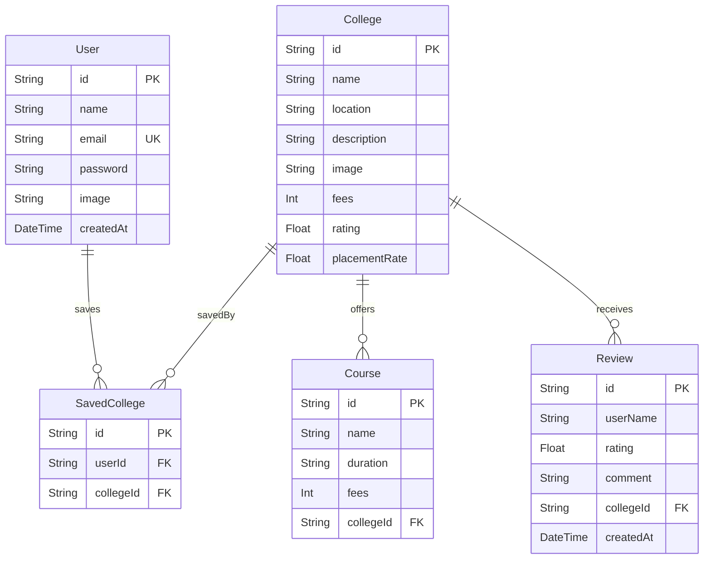

# CampusCompass — Full Stack College Discovery Platform Documentation

CampusCompass is a production-oriented SaaS-style MVP built with Next.js 15, TypeScript, Tailwind CSS, Prisma 7, and Neon PostgreSQL. This documentation outlines the architecture, product philosophy, user interface, and contains the entire verbatim code for every file in the codebase.

---

## 1. Product Philosophy & UX Design

CampusCompass prioritizes fast discovery, structured comparison, low cognitive load, and decision-oriented UX.

- **Fast Discovery**: Clean landing pages with prominent search options. Instant, debounced (400ms) search input dynamically filters results across multiple fields (name, location, and course titles).
- **Structured Comparison**: Side-by-side comparison matrix of up to 3 colleges, dynamically highlighting best-value attributes (lowest fees, highest placement rate, highest student ratings).
- **Reduced Cognitive Load**: Eliminates layout clutter. Specifically, single-purpose focus pages (such as Login and Registration) omit the global navbar and footer to keep users focused on their primary actions.
- **Harmony CSS System**: Uses Tailwind CSS v4 to implement premium layout spacing, micro-animations (like custom spinners), glassmorphism styles, and clean border separations.
- **Visual Design**: Uses a curated color palette featuring deep indigo, slate grays, and forest green badges for highlighting superior characteristics.

---

## 2. System Architecture & Routing Strategy

CampusCompass utilizes Next.js 15's App Router to manage page render cycles efficiently:

- **Server-Side Rendered (SSR) / Server Components**: Listing, details, home, and compare pages perform data fetching on the server. This ensures minimal client-side Javascript, fast initial loads, and SEO best practices.
- **Client Components (`"use client"`)**: Filters, dynamic search inputs, comparison contexts, state buttons, and modal dialogs are designated as client components to provide smooth interactivity.
- **Dynamic Caching**:
  - Details and listing pages are rendered dynamically using `export const dynamic = 'force-dynamic'` to display updated reviews, scores, and bookmarks immediately.
  - The compare page dynamically compares selected items from `localStorage`.
- **Database Model**: Defined in Prisma, storing users, colleges, course offerings, student reviews, and saved bookmarks (relationships are mapped with foreign key index optimizations).
- **Standardized API Layer**: All endpoint responses are strictly formatted:
  - Success: `{ success: true, data: { ... } }`
  - Error: `{ success: false, message: "Error description" }`
  - Validations: Handled strictly using **Zod** schema parses at boundaries.

---

## 3. Database Schema Diagram (Mermaid)



---

## 4. UI Layout Overview
- **Landing Page (`/`)**: Hero presentation with visual analytics banners, value propositions, and action links.
- **Listing & Filters (`/colleges`)**: Two-column layout on desktop. Left sidebar filters by location, stream, rating, and fee range. Right grid renders college cards dynamically with offset pagination. 
- **College Details (`/colleges/[id]`)**: Tabbed container interface:
  - **Overview**: Description, campus details, and statistics.
  - **Courses**: Searchable list of undergraduate and postgraduate streams with fees.
  - **Placements**: Stat grids (average packages, placement rates) and key hiring companies.
  - **Reviews**: Aggregated score, comments stream, and review submission forms.
- **Comparison Drawer & Page (`/compare`)**: Floating sticky bottom bar displaying selected thumbnails. The full-page comparison shows side-by-side matrices, emphasizing best metrics in green.
- **Dashboard (`/dashboard`)**: Profile badge, total count card, and responsive card listing of saved colleges. Supports optimistic item removals.

---

## 5. Complete Codebase Directory

Below is the verbatim source code of every file in the project.


### File: `app/(auth)/login/page.tsx`

```typescript
'use client';

import React, { useState, Suspense } from 'react';
import { signIn } from 'next-auth/react';
import { useRouter, useSearchParams } from 'next/navigation';
import Link from 'next/link';
import { Compass, Mail, Lock, AlertCircle } from 'lucide-react';
import { Button } from '@/components/ui/button';
import { toast } from 'sonner';

function LoginForm() {
  const router = useRouter();
  const searchParams = useSearchParams();
  const callbackUrl = searchParams.get('callbackUrl') || '/dashboard';

  const [email, setEmail] = useState('');
  const [password, setPassword] = useState('');
  const [error, setError] = useState('');
  const [isLoading, setIsLoading] = useState(false);

  const handleSubmit = async (e: React.FormEvent) => {
    e.preventDefault();
    if (!email || !password) {
      setError('Please fill in all fields');
      return;
    }

    setIsLoading(true);
    setError('');

    try {
      const res = await signIn('credentials', {
        email,
        password,
        redirect: false,
        callbackUrl,
      });

      if (res?.error) {
        setError(res.error || 'Invalid credentials');
        toast.error('Login failed', { description: res.error });
      } else {
        toast.success('Successfully logged in!');
        router.push(callbackUrl);
        router.refresh();
      }
    } catch (err: any) {
      setError('An unexpected error occurred. Please try again.');
    } finally {
      setIsLoading(false);
    }
  };

  return (
    <div className="w-full max-w-md bg-white border border-gray-150 rounded-2xl shadow-sm p-8 space-y-6">
      {/* Brand Logo & Title */}
      <div className="text-center space-y-2">
        <Link href="/" className="inline-flex items-center space-x-2">
          <Compass className="h-8 w-8 text-indigo-650" />
          <span className="font-bold text-2xl tracking-tight text-gray-900">
            Campus<span className="text-indigo-600">Compass</span>
          </span>
        </Link>
        <h2 className="text-xl font-bold text-gray-900 tracking-tight">Log in to your account</h2>
        <p className="text-xs text-gray-400">
          Welcome back! Save and review colleges.
        </p>
      </div>

      {/* Errors display */}
      {error && (
        <div className="bg-red-50 border border-red-150 p-3 rounded-lg text-xs text-red-650 flex items-start space-x-2">
          <AlertCircle className="h-4 w-4 shrink-0 mt-0.5" />
          <span>{error}</span>
        </div>
      )}

      {/* Login form */}
      <form onSubmit={handleSubmit} className="space-y-4">
        <div className="space-y-1.5">
          <label className="text-xs font-semibold text-gray-655 uppercase tracking-wider">Email Address</label>
          <div className="relative">
            <Mail className="absolute left-3 top-1/2 -translate-y-1/2 h-4 w-4 text-gray-400" />
            <input
              type="email"
              required
              placeholder="you@example.com"
              value={email}
              onChange={(e) => setEmail(e.target.value)}
              className="w-full pl-9 pr-4 py-2 border border-gray-200 focus:border-indigo-500 rounded-lg text-sm bg-gray-50/20 focus:outline-none focus:ring-1 focus:ring-indigo-500 transition-colors"
            />
          </div>
        </div>

        <div className="space-y-1.5">
          <div className="flex justify-between items-center">
            <label className="text-xs font-semibold text-gray-655 uppercase tracking-wider">Password</label>
          </div>
          <div className="relative">
            <Lock className="absolute left-3 top-1/2 -translate-y-1/2 h-4 w-4 text-gray-400" />
            <input
              type="password"
              required
              placeholder="••••••••"
              value={password}
              onChange={(e) => setPassword(e.target.value)}
              className="w-full pl-9 pr-4 py-2 border border-gray-200 focus:border-indigo-500 rounded-lg text-sm bg-gray-50/20 focus:outline-none focus:ring-1 focus:ring-indigo-500 transition-colors"
            />
          </div>
        </div>

        <Button
          type="submit"
          isLoading={isLoading}
          className="w-full bg-indigo-600 hover:bg-indigo-700 text-white font-semibold py-2.5 mt-2"
        >
          Log In
        </Button>
      </form>

      <div className="text-center pt-2 border-t border-gray-100 text-xs text-gray-500">
        Don&apos;t have an account?{' '}
        <Link href="/register" className="font-semibold text-indigo-650 hover:text-indigo-850 transition-colors">
          Sign up here
        </Link>
      </div>
    </div>
  );
}

export default function LoginPage() {
  return (
    <div className="min-h-[80vh] flex flex-col justify-center items-center px-4 sm:px-6 lg:px-8 py-12">
      <Suspense fallback={
        <div className="w-full max-w-md bg-white border border-gray-150 rounded-2xl p-8 text-center space-y-4 shadow-sm">
          <div className="h-6 w-32 bg-gray-200 animate-pulse mx-auto rounded" />
          <div className="h-10 w-full bg-gray-200 animate-pulse rounded" />
          <div className="h-10 w-full bg-gray-200 animate-pulse rounded" />
        </div>
      }>
        <LoginForm />
      </Suspense>
    </div>
  );
}

```

---

### File: `app/(auth)/register/page.tsx`

```typescript
'use client';

import React, { useState } from 'react';
import { signIn } from 'next-auth/react';
import { useRouter } from 'next/navigation';
import Link from 'next/link';
import { Compass, Mail, Lock, User, AlertCircle } from 'lucide-react';
import { Button } from '@/components/ui/button';
import { toast } from 'sonner';

export default function RegisterPage() {
  const router = useRouter();
  const [name, setName] = useState('');
  const [email, setEmail] = useState('');
  const [password, setPassword] = useState('');
  const [confirmPassword, setConfirmPassword] = useState('');
  const [error, setError] = useState('');
  const [isLoading, setIsLoading] = useState(false);

  const handleSubmit = async (e: React.FormEvent) => {
    e.preventDefault();
    setError('');

    // Pre-validations
    if (!name || !email || !password || !confirmPassword) {
      setError('Please fill in all fields');
      return;
    }

    if (password.length < 6) {
      setError('Password must be at least 6 characters long');
      return;
    }

    if (password !== confirmPassword) {
      setError('Passwords do not match');
      return;
    }

    setIsLoading(true);

    try {
      // Register user
      const res = await fetch('/api/register', {
        method: 'POST',
        headers: { 'Content-Type': 'application/json' },
        body: JSON.stringify({ name, email, password }),
      });

      const data = await res.json();

      if (!res.ok || !data.success) {
        throw new Error(data.message || 'Registration failed');
      }

      toast.success('Registration successful! Logging you in...');

      // Auto sign in user
      const signinRes = await signIn('credentials', {
        email,
        password,
        redirect: false,
        callbackUrl: '/dashboard',
      });

      if (signinRes?.error) {
        toast.error('Auto login failed', { description: signinRes.error });
        router.push('/login');
      } else {
        router.push('/dashboard');
        router.refresh();
      }
    } catch (err: any) {
      setError(err.message || 'An unexpected error occurred. Please try again.');
    } finally {
      setIsLoading(false);
    }
  };

  return (
    <div className="min-h-[85vh] flex flex-col justify-center items-center px-4 sm:px-6 lg:px-8 py-12">
      <div className="w-full max-w-md bg-white border border-gray-150 rounded-2xl shadow-sm p-8 space-y-6">
        {/* Logo and Titles */}
        <div className="text-center space-y-2">
          <Link href="/" className="inline-flex items-center space-x-2">
            <Compass className="h-8 w-8 text-indigo-650" />
            <span className="font-bold text-2xl tracking-tight text-gray-900">
              Campus<span className="text-indigo-600">Compass</span>
            </span>
          </Link>
          <h2 className="text-xl font-bold text-gray-900 tracking-tight">Create your account</h2>
          <p className="text-xs text-gray-400">
            Sign up to build and save your college comparison list.
          </p>
        </div>

        {/* Errors display */}
        {error && (
          <div className="bg-red-50 border border-red-150 p-3 rounded-lg text-xs text-red-655 flex items-start space-x-2">
            <AlertCircle className="h-4 w-4 shrink-0 mt-0.5" />
            <span>{error}</span>
          </div>
        )}

        {/* Registration form */}
        <form onSubmit={handleSubmit} className="space-y-4">
          <div className="space-y-1.5">
            <label className="text-xs font-semibold text-gray-655 uppercase tracking-wider">Full Name</label>
            <div className="relative">
              <User className="absolute left-3 top-1/2 -translate-y-1/2 h-4 w-4 text-gray-400" />
              <input
                type="text"
                required
                placeholder="Rahul Sharma"
                value={name}
                onChange={(e) => setName(e.target.value)}
                className="w-full pl-9 pr-4 py-2 border border-gray-200 focus:border-indigo-500 rounded-lg text-sm bg-gray-50/20 focus:outline-none focus:ring-1 focus:ring-indigo-500 transition-colors"
              />
            </div>
          </div>

          <div className="space-y-1.5">
            <label className="text-xs font-semibold text-gray-655 uppercase tracking-wider">Email Address</label>
            <div className="relative">
              <Mail className="absolute left-3 top-1/2 -translate-y-1/2 h-4 w-4 text-gray-400" />
              <input
                type="email"
                required
                placeholder="rahul@example.com"
                value={email}
                onChange={(e) => setEmail(e.target.value)}
                className="w-full pl-9 pr-4 py-2 border border-gray-200 focus:border-indigo-500 rounded-lg text-sm bg-gray-50/20 focus:outline-none focus:ring-1 focus:ring-indigo-500 transition-colors"
              />
            </div>
          </div>

          <div className="space-y-1.5">
            <label className="text-xs font-semibold text-gray-655 uppercase tracking-wider">Password</label>
            <div className="relative">
              <Lock className="absolute left-3 top-1/2 -translate-y-1/2 h-4 w-4 text-gray-400" />
              <input
                type="password"
                required
                placeholder="Minimum 6 characters"
                value={password}
                onChange={(e) => setPassword(e.target.value)}
                className="w-full pl-9 pr-4 py-2 border border-gray-200 focus:border-indigo-500 rounded-lg text-sm bg-gray-50/20 focus:outline-none focus:ring-1 focus:ring-indigo-500 transition-colors"
              />
            </div>
          </div>

          <div className="space-y-1.5">
            <label className="text-xs font-semibold text-gray-655 uppercase tracking-wider">Confirm Password</label>
            <div className="relative">
              <Lock className="absolute left-3 top-1/2 -translate-y-1/2 h-4 w-4 text-gray-400" />
              <input
                type="password"
                required
                placeholder="Re-enter password"
                value={confirmPassword}
                onChange={(e) => setConfirmPassword(e.target.value)}
                className="w-full pl-9 pr-4 py-2 border border-gray-200 focus:border-indigo-500 rounded-lg text-sm bg-gray-50/20 focus:outline-none focus:ring-1 focus:ring-indigo-500 transition-colors"
              />
            </div>
          </div>

          <Button
            type="submit"
            isLoading={isLoading}
            className="w-full bg-indigo-600 hover:bg-indigo-700 text-white font-semibold py-2.5 mt-2"
          >
            Create Account
          </Button>
        </form>

        <div className="text-center pt-2 border-t border-gray-100 text-xs text-gray-500">
          Already have an account?{' '}
          <Link href="/login" className="font-semibold text-indigo-600 hover:text-indigo-850 transition-colors">
            Log in here
          </Link>
        </div>
      </div>
    </div>
  );
}

```

---

### File: `app/api/auth/[...nextauth]/route.ts`

```typescript
import NextAuth from 'next-auth';
import { authOptions } from '@/lib/auth';

const handler = NextAuth(authOptions);

export { handler as GET, handler as POST };

```

---

### File: `app/api/colleges/route.ts`

```typescript
import { NextRequest } from 'next/server';
import { prisma } from '@/lib/prisma';
import { apiSuccess, apiError } from '@/lib/utils';
import { CollegesQuerySchema } from '@/lib/validations';
import { Prisma } from '@prisma/client';

export async function GET(request: NextRequest) {
  try {
    const searchParams = Object.fromEntries(request.nextUrl.searchParams);
    
    // Parse and validate query parameters
    const parsed = CollegesQuerySchema.safeParse(searchParams);
    if (!parsed.success) {
      return apiError(parsed.error.issues[0]?.message || 'Invalid query parameters');
    }

    const {
      search,
      location,
      minFees,
      maxFees,
      minRating,
      courseType,
      sortBy,
      sortOrder,
      page,
      limit,
    } = parsed.data;

    const where: Prisma.CollegeWhereInput = {
      rating: { gte: minRating },
      fees: { gte: minFees, lte: maxFees },
    };

    const andConditions: Prisma.CollegeWhereInput[] = [];

    // Search query: check name, location, or courses
    if (search) {
      andConditions.push({
        OR: [
          { name: { contains: search } },
          { location: { contains: search } },
          { courses: { some: { name: { contains: search } } } },
        ],
      });
    }

    // Location filter
    if (location) {
      andConditions.push({
        location: { contains: location },
      });
    }

    // Course type filter (e.g. B.Tech, MBA, B.Sc)
    if (courseType) {
      andConditions.push({
        courses: {
          some: {
            name: { contains: courseType },
          },
        },
      });
    }

    if (andConditions.length > 0) {
      where.AND = andConditions;
    }

    // Dynamic ordering
    const orderBy: Prisma.CollegeOrderByWithRelationInput = {};
    if (sortBy === 'rating') {
      orderBy.rating = sortOrder;
    } else if (sortBy === 'fees') {
      orderBy.fees = sortOrder;
    } else if (sortBy === 'name') {
      orderBy.name = sortOrder;
    }

    const skip = (page - 1) * limit;

    // Fetch colleges and total count in parallel
    const [colleges, totalCount] = await Promise.all([
      prisma.college.findMany({
        where,
        orderBy,
        skip,
        take: limit,
        include: {
          courses: true,
          reviews: true,
        },
      }),
      prisma.college.count({ where }),
    ]);

    const totalPages = Math.ceil(totalCount / limit);

    return apiSuccess({
      colleges,
      pagination: {
        totalCount,
        page,
        totalPages,
        limit,
      },
    });
  } catch (error: any) {
    console.error('Error in GET /api/colleges:', error);
    return apiError('Internal server error occurred', 500);
  }
}

```

---

### File: `app/api/colleges/[id]/reviews/route.ts`

```typescript
import { NextRequest } from 'next/server';
import { getServerSession } from 'next-auth';
import { authOptions } from '@/lib/auth';
import { prisma } from '@/lib/prisma';
import { apiSuccess, apiError } from '@/lib/utils';
import { z } from 'zod';

const ReviewCreateSchema = z.object({
  rating: z.number().min(1).max(5),
  comment: z.string().min(10, 'Comment must be at least 10 characters long'),
});

export async function POST(
  request: NextRequest,
  { params }: { params: Promise<{ id: string }> }
) {
  try {
    const session = await getServerSession(authOptions);
    if (!session?.user?.id) {
      return apiError('Unauthorized. Please log in to post a review.', 401);
    }

    const { id: collegeId } = await params;
    if (!collegeId) {
      return apiError('College ID is required', 400);
    }

    const body = await request.json().catch(() => ({}));
    
    // Validate inputs
    const parsed = ReviewCreateSchema.safeParse(body);
    if (!parsed.success) {
      return apiError(parsed.error.issues[0]?.message || 'Invalid input details');
    }

    const { rating, comment } = parsed.data;

    // Check if college exists
    const collegeExists = await prisma.college.findUnique({
      where: { id: collegeId },
    });

    if (!collegeExists) {
      return apiError('College not found', 404);
    }

    // Determine user display name
    const userName = session.user.name || session.user.email?.split('@')[0] || 'Anonymous';

    // Create review
    const review = await prisma.review.create({
      data: {
        userName,
        rating,
        comment,
        collegeId,
      },
    });

    return apiSuccess(review, 201);
  } catch (error: any) {
    console.error('Error in POST /api/colleges/[id]/reviews:', error);
    return apiError('Internal server error occurred', 500);
  }
}

```

---

### File: `app/api/colleges/[id]/route.ts`

```typescript
import { NextRequest } from 'next/server';
import { prisma } from '@/lib/prisma';
import { apiSuccess, apiError } from '@/lib/utils';

export async function GET(
  request: NextRequest,
  { params }: { params: Promise<{ id: string }> }
) {
  try {
    const { id } = await params;

    if (!id) {
      return apiError('College ID is required', 400);
    }

    const college = await prisma.college.findUnique({
      where: { id },
      include: {
        courses: true,
        reviews: {
          orderBy: {
            createdAt: 'desc',
          },
        },
      },
    });

    if (!college) {
      return apiError('College not found', 404);
    }

    return apiSuccess(college);
  } catch (error: any) {
    console.error('Error in GET /api/colleges/[id]:', error);
    return apiError('Internal server error occurred', 500);
  }
}

```

---

### File: `app/api/compare/route.ts`

```typescript
import { NextRequest } from 'next/server';
import { prisma } from '@/lib/prisma';
import { apiSuccess, apiError } from '@/lib/utils';
import { CompareQuerySchema } from '@/lib/validations';

export async function GET(request: NextRequest) {
  try {
    const { searchParams } = request.nextUrl;
    const idsString = searchParams.get('ids');

    if (!idsString) {
      return apiError('College IDs are required. Use format: ?ids=id1,id2,id3');
    }

    // Validate query parameter layout using Zod
    const parsed = CompareQuerySchema.safeParse({ ids: idsString });
    if (!parsed.success) {
      return apiError(parsed.error.issues[0]?.message || 'Invalid comparison query');
    }

    const idsArray = idsString.split(',').filter(Boolean);

    const colleges = await prisma.college.findMany({
      where: {
        id: {
          in: idsArray,
        },
      },
      include: {
        courses: true,
        reviews: true,
      },
    });

    // Rearrange colleges in the order of request IDs to preserve compare table alignment
    const orderedColleges = idsArray
      .map((id) => colleges.find((col) => col.id === id))
      .filter((col): col is NonNullable<typeof col> => !!col);

    return apiSuccess(orderedColleges);
  } catch (error: any) {
    console.error('Error in GET /api/compare:', error);
    return apiError('Internal server error occurred', 500);
  }
}

```

---

### File: `app/api/register/route.ts`

```typescript
import { NextRequest } from 'next/server';
import { prisma } from '@/lib/prisma';
import { apiSuccess, apiError } from '@/lib/utils';
import { RegisterSchema } from '@/lib/validations';
import * as bcrypt from 'bcryptjs';

export async function POST(request: NextRequest) {
  try {
    const body = await request.json().catch(() => ({}));

    // Validate body using Zod schema
    const parsed = RegisterSchema.safeParse(body);
    if (!parsed.success) {
      return apiError(parsed.error.issues[0]?.message || 'Invalid input details');
    }

    const { name, email, password } = parsed.data;

    // Check if user already exists
    const existingUser = await prisma.user.findUnique({
      where: { email: email.toLowerCase() },
    });

    if (existingUser) {
      return apiError('A user with this email already exists', 400);
    }

    // Hash password
    const hashedPassword = await bcrypt.hash(password, 10);

    // Create user
    const user = await prisma.user.create({
      data: {
        name,
        email: email.toLowerCase(),
        password: hashedPassword,
      },
      select: {
        id: true,
        name: true,
        email: true,
        createdAt: true,
      },
    });

    return apiSuccess({ user }, 201);
  } catch (error: any) {
    console.error('Error in POST /api/register:', error);
    return apiError('Internal server error occurred', 500);
  }
}

```

---

### File: `app/api/saved/route.ts`

```typescript
import { NextRequest } from 'next/server';
import { getServerSession } from 'next-auth';
import { authOptions } from '@/lib/auth';
import { prisma } from '@/lib/prisma';
import { apiSuccess, apiError } from '@/lib/utils';
import { SavedActionSchema } from '@/lib/validations';

export async function POST(request: NextRequest) {
  try {
    // Check authentication
    const session = await getServerSession(authOptions);
    if (!session?.user?.id) {
      return apiError('Unauthorized. Please log in first.', 401);
    }

    const body = await request.json().catch(() => ({}));
    
    // Validate input payload
    const parsed = SavedActionSchema.safeParse(body);
    if (!parsed.success) {
      return apiError(parsed.error.issues[0]?.message || 'Invalid input payload');
    }

    const { collegeId } = parsed.data;

    // Check if the college exists
    const collegeExists = await prisma.college.findUnique({
      where: { id: collegeId },
    });

    if (!collegeExists) {
      return apiError('Target college does not exist', 404);
    }

    // Check if already saved
    const existingSave = await prisma.savedCollege.findUnique({
      where: {
        userId_collegeId: {
          userId: session.user.id,
          collegeId,
        },
      },
    });

    if (existingSave) {
      return apiSuccess(existingSave);
    }

    // Create saved relationship
    const savedCollege = await prisma.savedCollege.create({
      data: {
        userId: session.user.id,
        collegeId,
      },
    });

    return apiSuccess(savedCollege, 210);
  } catch (error: any) {
    console.error('Error in POST /api/saved:', error);
    return apiError('Internal server error occurred', 500);
  }
}

```

---

### File: `app/api/saved/[id]/route.ts`

```typescript
import { NextRequest } from 'next/server';
import { getServerSession } from 'next-auth';
import { authOptions } from '@/lib/auth';
import { prisma } from '@/lib/prisma';
import { apiSuccess, apiError } from '@/lib/utils';

export async function DELETE(
  request: NextRequest,
  { params }: { params: Promise<{ id: string }> }
) {
  try {
    const session = await getServerSession(authOptions);
    if (!session?.user?.id) {
      return apiError('Unauthorized. Please log in first.', 401);
    }

    const { id: collegeId } = await params;
    if (!collegeId) {
      return apiError('College ID is required', 400);
    }

    // Check if relation exists
    const existingSave = await prisma.savedCollege.findUnique({
      where: {
        userId_collegeId: {
          userId: session.user.id,
          collegeId,
        },
      },
    });

    if (!existingSave) {
      return apiError('Saved college record not found', 404);
    }

    // Delete relation
    await prisma.savedCollege.delete({
      where: {
        userId_collegeId: {
          userId: session.user.id,
          collegeId,
        },
      },
    });

    return apiSuccess({ message: 'Removed from favorites list' });
  } catch (error: any) {
    console.error('Error in DELETE /api/saved/[id]:', error);
    return apiError('Internal server error occurred', 500);
  }
}

```

---

### File: `app/college/[id]/page.tsx`

```typescript
import { redirect } from 'next/navigation';

interface PageProps {
  params: Promise<{ id: string }>;
}

export default async function CollegeRedirectPage({ params }: PageProps) {
  const { id } = await params;
  redirect(`/colleges/${id}`);
}

```

---

### File: `app/colleges/loading.tsx`

```typescript
import React from 'react';
import { Skeleton } from '@/components/ui/skeleton';
import { SlidersHorizontal } from 'lucide-react';

export default function CollegesLoading() {
  return (
    <div className="max-w-7xl mx-auto px-4 sm:px-6 lg:px-8 py-8 space-y-6">
      {/* Header Skeleton */}
      <div className="flex flex-col md:flex-row justify-between items-start md:items-center gap-4">
        <div className="space-y-2">
          <Skeleton className="h-8 w-48" />
          <Skeleton className="h-4 w-72" />
        </div>
        <Skeleton className="h-10 w-32" />
      </div>

      <div className="flex flex-col md:flex-row gap-8">
        {/* Sidebar Skeleton (Desktop only) */}
        <div className="hidden md:block w-72 shrink-0 space-y-6 bg-white border border-gray-150 rounded-xl p-5">
          <div className="flex justify-between items-center pb-4 border-b border-gray-100">
            <div className="flex items-center space-x-2">
              <SlidersHorizontal className="h-4 w-4 text-gray-300" />
              <Skeleton className="h-4 w-12" />
            </div>
            <Skeleton className="h-4 w-16" />
          </div>
          {[1, 2, 3, 4, 5].map((idx) => (
            <div key={idx} className="space-y-2">
              <Skeleton className="h-3 w-16" />
              <Skeleton className="h-9 w-full" />
            </div>
          ))}
        </div>

        {/* Mobile Filters trigger Skeleton */}
        <div className="md:hidden w-full h-16 bg-white border border-gray-150 rounded-xl flex items-center justify-between p-4">
          <Skeleton className="h-4 w-32" />
          <Skeleton className="h-8 w-20" />
        </div>

        {/* Grid List Cards Skeletons */}
        <div className="flex-grow space-y-6">
          <div className="grid grid-cols-1 sm:grid-cols-2 lg:grid-cols-3 gap-6">
            {[1, 2, 3, 4, 5, 6].map((idx) => (
              <div
                key={idx}
                className="bg-white border border-gray-150 rounded-xl overflow-hidden shadow-xs h-[390px] flex flex-col p-5 space-y-4"
              >
                {/* Image Placeholder */}
                <Skeleton className="h-40 w-full rounded-lg" />
                {/* Title */}
                <div className="space-y-2">
                  <Skeleton className="h-5 w-3/4" />
                  <Skeleton className="h-3 w-1/2" />
                </div>
                {/* Stats */}
                <div className="grid grid-cols-2 gap-3 py-3 border-y border-gray-100">
                  <div className="space-y-1">
                    <Skeleton className="h-3 w-12" />
                    <Skeleton className="h-4 w-20" />
                  </div>
                  <div className="space-y-1 pl-3">
                    <Skeleton className="h-3 w-12" />
                    <Skeleton className="h-4 w-16" />
                  </div>
                </div>
                {/* Courses */}
                <div className="space-y-2">
                  <Skeleton className="h-3.5 w-16" />
                  <div className="flex gap-2">
                    <Skeleton className="h-5 w-20" />
                    <Skeleton className="h-5 w-16" />
                  </div>
                </div>
                {/* Button actions */}
                <div className="flex gap-2 pt-2 mt-auto">
                  <Skeleton className="h-8 flex-grow" />
                  <Skeleton className="h-8 w-8" />
                </div>
              </div>
            ))}
          </div>
        </div>
      </div>
    </div>
  );
}

```

---

### File: `app/colleges/page.tsx`

```typescript
import React from 'react';
import { getServerSession } from 'next-auth';
import { authOptions } from '@/lib/auth';
import { prisma } from '@/lib/prisma';
import { CollegesQuerySchema } from '@/lib/validations';
import CollegeCard from '@/components/college/CollegeCard';
import FilterSidebar from '@/components/filters/FilterSidebar';
import MobileFilterDrawer from '@/components/filters/MobileFilterDrawer';
import { Button } from '@/components/ui/button';
import { Compass, GraduationCap, ChevronLeft, ChevronRight } from 'lucide-react';
import Link from 'next/link';
import { Prisma } from '@prisma/client';

export const dynamic = 'force-dynamic';

interface PageProps {
  searchParams: Promise<Record<string, string | undefined>>;
}

export default async function CollegesPage({ searchParams }: PageProps) {
  // Await searchParams as required by Next.js 15
  const resolvedSearchParams = await searchParams;

  // Validate queries with Zod
  const parsed = CollegesQuerySchema.safeParse(resolvedSearchParams);
  const query = parsed.success ? parsed.data : CollegesQuerySchema.parse({});

  const session = await getServerSession(authOptions);

  // Fetch saved college IDs if logged in
  let savedCollegeIdsSet = new Set<string>();
  if (session?.user?.id) {
    const saved = await prisma.savedCollege.findMany({
      where: { userId: session.user.id },
      select: { collegeId: true },
    });
    savedCollegeIdsSet = new Set(saved.map((s) => s.collegeId));
  }

  // Construct filters where clauses
  const {
    search,
    location,
    minFees,
    maxFees,
    minRating,
    courseType,
    sortBy,
    sortOrder,
    page,
    limit,
  } = query;

  const where: Prisma.CollegeWhereInput = {
    rating: { gte: minRating },
    fees: { gte: minFees, lte: maxFees },
  };

  const andConditions: Prisma.CollegeWhereInput[] = [];

  if (search) {
    andConditions.push({
      OR: [
        { name: { contains: search } },
        { location: { contains: search } },
        { courses: { some: { name: { contains: search } } } },
      ],
    });
  }

  if (location) {
    andConditions.push({
      location: { contains: location },
    });
  }

  if (courseType) {
    andConditions.push({
      courses: {
        some: {
          name: { contains: courseType },
        },
      },
    });
  }

  if (andConditions.length > 0) {
    where.AND = andConditions;
  }

  const orderBy: Prisma.CollegeOrderByWithRelationInput = {};
  if (sortBy === 'rating') {
    orderBy.rating = sortOrder;
  } else if (sortBy === 'fees') {
    orderBy.fees = sortOrder;
  } else if (sortBy === 'name') {
    orderBy.name = sortOrder;
  }

  const skip = (page - 1) * limit;

  // Database queries
  const [colleges, totalCount] = await Promise.all([
    prisma.college.findMany({
      where,
      orderBy,
      skip,
      take: limit,
      include: {
        courses: true,
      },
    }),
    prisma.college.count({ where }),
  ]);

  const totalPages = Math.ceil(totalCount / limit);

  // Helper to build page link url
  const buildPageUrl = (targetPage: number) => {
    const params = new URLSearchParams();
    Object.entries(resolvedSearchParams).forEach(([key, val]) => {
      if (val && key !== 'page') {
        params.set(key, val);
      }
    });
    params.set('page', targetPage.toString());
    return `/colleges?${params.toString()}`;
  };

  return (
    <div className="max-w-7xl mx-auto px-4 sm:px-6 lg:px-8 py-8 space-y-6">
      {/* Title Header */}
      <div className="flex flex-col md:flex-row md:items-center justify-between gap-4 pb-2">
        <div className="space-y-1">
          <h1 className="text-2xl sm:text-3xl font-bold tracking-tight text-gray-900 flex items-center">
            <GraduationCap className="mr-2 h-7 w-7 text-indigo-600" />
            Discover Colleges
          </h1>
          <p className="text-sm text-gray-500 font-medium">
            Compare courses, fees, placements and reviews of top universities.
          </p>
        </div>
        <div className="text-sm font-semibold text-gray-600 bg-gray-100 px-3 py-1.5 rounded-lg w-fit">
          Found {totalCount} college{totalCount === 1 ? '' : 's'}
        </div>
      </div>

      <div className="flex flex-col md:flex-row gap-8">
        {/* Left Side Filters (Desktop Sidebar) */}
        <div className="hidden md:block w-72 shrink-0">
          <FilterSidebar />
        </div>

        {/* Mobile Filters Drawer trigger */}
        <div className="md:hidden">
          <MobileFilterDrawer />
        </div>

        {/* Right Side College Grid */}
        <div className="flex-grow space-y-6">
          {colleges.length === 0 ? (
            /* Empty State */
            <div className="flex flex-col items-center justify-center border border-dashed border-gray-200 rounded-2xl bg-white p-12 text-center h-[400px]">
              <div className="bg-indigo-50 p-4 rounded-full text-indigo-600 mb-4">
                <Compass className="h-8 w-8 animate-spin-slow" />
              </div>
              <h3 className="font-bold text-lg text-gray-900">No colleges match your filters</h3>
              <p className="text-sm text-gray-500 max-w-sm mt-1 mb-6">
                Try loosening your parameters, changing location, or clearing search criteria.
              </p>
              <Link href="/colleges">
                <Button variant="primary" size="sm">
                  Reset All Filters
                </Button>
              </Link>
            </div>
          ) : (
            <>
              {/* College Cards Grid */}
              <div className="grid grid-cols-1 sm:grid-cols-2 lg:grid-cols-3 gap-6">
                {colleges.map((college) => (
                  <CollegeCard
                    key={college.id}
                    college={college}
                    initialIsSaved={savedCollegeIdsSet.has(college.id)}
                  />
                ))}
              </div>

              {/* Server-side Offset Pagination controls */}
              {totalPages > 1 && (
                <div className="flex justify-between items-center pt-6 border-t border-gray-100">
                  <div className="text-xs font-semibold text-gray-500">
                    Page {page} of {totalPages}
                  </div>
                  <div className="flex items-center space-x-2">
                    {page > 1 ? (
                      <Link href={buildPageUrl(page - 1)}>
                        <Button variant="outline" size="sm" className="h-8 px-3 text-xs flex items-center cursor-pointer">
                          <ChevronLeft className="h-3.5 w-3.5 mr-1" />
                          Previous
                        </Button>
                      </Link>
                    ) : (
                      <Button variant="outline" size="sm" disabled className="h-8 px-3 text-xs flex items-center">
                        <ChevronLeft className="h-3.5 w-3.5 mr-1" />
                        Previous
                      </Button>
                    )}

                    {page < totalPages ? (
                      <Link href={buildPageUrl(page + 1)}>
                        <Button variant="outline" size="sm" className="h-8 px-3 text-xs flex items-center cursor-pointer">
                          Next
                          <ChevronRight className="h-3.5 w-3.5 ml-1" />
                        </Button>
                      </Link>
                    ) : (
                      <Button variant="outline" size="sm" disabled className="h-8 px-3 text-xs flex items-center">
                        Next
                        <ChevronRight className="h-3.5 w-3.5 ml-1" />
                      </Button>
                    )}
                  </div>
                </div>
              )}
            </>
          )}
        </div>
      </div>
    </div>
  );
}

```

---

### File: `app/colleges/[id]/page.tsx`

```typescript
import React from 'react';
import { getServerSession } from 'next-auth';
import { authOptions } from '@/lib/auth';
import { prisma } from '@/lib/prisma';
import CollegeHero from '@/components/college/CollegeHero';
import CourseList from '@/components/college/CourseList';
import ReviewsSection from '@/components/college/ReviewsSection';
import { notFound } from 'next/navigation';
import { Building2, Landmark, Trophy, FileText } from 'lucide-react';
import { Card, CardContent } from '@/components/ui/card';

interface PageProps {
  params: Promise<{ id: string }>;
}

export default async function CollegeDetailPage({ params }: PageProps) {
  const { id } = await params;

  // Fetch college details
  const college = await prisma.college.findUnique({
    where: { id },
    include: {
      courses: true,
      reviews: {
        orderBy: {
          createdAt: 'desc',
        },
      },
    },
  });

  if (!college) {
    notFound();
  }

  const session = await getServerSession(authOptions);

  // Check if saved
  let isSaved = false;
  if (session?.user?.id) {
    const saved = await prisma.savedCollege.findUnique({
      where: {
        userId_collegeId: {
          userId: session.user.id,
          collegeId: id,
        },
      },
    });
    isSaved = !!saved;
  }

  return (
    <div className="flex flex-col min-h-screen pb-12">
      {/* College Hero Section */}
      <CollegeHero college={college} initialIsSaved={isSaved} />

      {/* Sticky Tab Navigation bar */}
      <div className="sticky top-16 z-25 bg-white/95 backdrop-blur-xs border-b border-gray-200 shadow-3xs">
        <div className="max-w-7xl mx-auto px-4 sm:px-6 lg:px-8">
          <nav className="flex space-x-8 h-12 items-center text-xs font-semibold text-gray-500 uppercase tracking-wider overflow-x-auto whitespace-nowrap">
            <a href="#overview" className="hover:text-indigo-650 py-3 border-b-2 border-transparent hover:border-indigo-600 transition-all">
              Overview
            </a>
            <a href="#courses" className="hover:text-indigo-650 py-3 border-b-2 border-transparent hover:border-indigo-600 transition-all">
              Courses ({college.courses.length})
            </a>
            <a href="#placements" className="hover:text-indigo-650 py-3 border-b-2 border-transparent hover:border-indigo-600 transition-all">
              Placements
            </a>
            <a href="#reviews" className="hover:text-indigo-650 py-3 border-b-2 border-transparent hover:border-indigo-600 transition-all">
              Reviews ({college.reviews.length})
            </a>
          </nav>
        </div>
      </div>

      {/* Main sections container */}
      <div className="max-w-7xl mx-auto px-4 sm:px-6 lg:px-8 py-8 space-y-12">
        {/* Section 1: Overview */}
        <section id="overview" className="scroll-mt-32 space-y-4">
          <h2 className="text-xl font-bold text-gray-900 flex items-center border-l-4 border-indigo-600 pl-3">
            <Building2 className="h-5 w-5 text-indigo-600 mr-2" />
            About the Institution
          </h2>
          <Card className="border border-gray-150">
            <CardContent className="p-6 space-y-4">
              <p className="text-sm text-gray-600 leading-relaxed">
                {college.description}
              </p>
              
              <div className="grid grid-cols-1 sm:grid-cols-2 md:grid-cols-3 gap-6 pt-4 border-t border-gray-55">
                <div className="space-y-1">
                  <span className="text-[10px] font-semibold text-gray-400 uppercase tracking-wider">Affiliation</span>
                  <div className="text-sm font-semibold text-gray-700 flex items-center">
                    <Landmark className="h-4.5 w-4.5 text-gray-400 mr-1.5" />
                    Government Recognized / Autonomous
                  </div>
                </div>

                <div className="space-y-1">
                  <span className="text-[10px] font-semibold text-gray-400 uppercase tracking-wider">Campus Setting</span>
                  <div className="text-sm font-semibold text-gray-700 flex items-center">
                    <Trophy className="h-4.5 w-4.5 text-gray-400 mr-1.5" />
                    State of the art Facilities
                  </div>
                </div>

                <div className="space-y-1">
                  <span className="text-[10px] font-semibold text-gray-400 uppercase tracking-wider">Accreditation</span>
                  <div className="text-sm font-semibold text-gray-700 flex items-center">
                    <FileText className="h-4.5 w-4.5 text-gray-400 mr-1.5" />
                    Grade A / A+ Certified
                  </div>
                </div>
              </div>
            </CardContent>
          </Card>
        </section>

        {/* Section 2: Courses */}
        <section id="courses" className="scroll-mt-32 space-y-4">
          <h2 className="text-xl font-bold text-gray-900 flex items-center border-l-4 border-indigo-600 pl-3">
            <FileText className="h-5 w-5 text-indigo-600 mr-2" />
            Courses & Fee Structure
          </h2>
          <CourseList courses={college.courses} />
        </section>

        {/* Section 3: Placements */}
        <section id="placements" className="scroll-mt-32 space-y-4">
          <h2 className="text-xl font-bold text-gray-900 flex items-center border-l-4 border-indigo-600 pl-3">
            <Trophy className="h-5 w-5 text-indigo-600 mr-2" />
            Placement Statistics
          </h2>
          <Card className="border border-gray-150">
            <CardContent className="p-6 space-y-6">
              <div className="grid grid-cols-1 md:grid-cols-3 gap-6 text-center">
                <div className="p-4 bg-slate-50 border border-slate-100 rounded-xl space-y-1">
                  <span className="text-xs text-gray-400 font-semibold uppercase tracking-wider">Placement Rate</span>
                  <div className="text-3xl font-extrabold text-emerald-600">
                    {college.placementRate > 0 ? `${college.placementRate.toFixed(1)}%` : 'N/A'}
                  </div>
                  <p className="text-[10px] text-gray-500">Percentage of registered students placed</p>
                </div>

                <div className="p-4 bg-slate-50 border border-slate-100 rounded-xl space-y-1">
                  <span className="text-xs text-gray-400 font-semibold uppercase tracking-wider">Avg Salary Package</span>
                  <div className="text-3xl font-extrabold text-gray-800">
                    {college.fees > 400000 ? '₹18.2 LPA' : '₹6.5 LPA'}
                  </div>
                  <p className="text-[10px] text-gray-500">Average package offered in recent drive</p>
                </div>

                <div className="p-4 bg-slate-50 border border-slate-100 rounded-xl space-y-1">
                  <span className="text-xs text-gray-400 font-semibold uppercase tracking-wider">Highest Package</span>
                  <div className="text-3xl font-extrabold text-indigo-600">
                    {college.fees > 400000 ? '₹48.0 LPA' : '₹15.5 LPA'}
                  </div>
                  <p className="text-[10px] text-gray-500">Peak package secured by graduates</p>
                </div>
              </div>

              {/* Recruiters Mock Grid */}
              <div className="space-y-3 pt-4 border-t border-gray-100">
                <h4 className="text-xs font-bold text-gray-500 uppercase tracking-wider">Top Recruiters & Partners</h4>
                <div className="grid grid-cols-2 sm:grid-cols-4 gap-4 text-center">
                  {['Google', 'Microsoft', 'McKinsey & Co', 'BCG', 'TCS', 'Infosys', 'Accenture', 'ICICI Bank'].slice(0, college.fees > 400000 ? 8 : 4).map((recruiter) => (
                    <div key={recruiter} className="py-3 px-4 border border-gray-100 bg-gray-50/30 rounded-lg text-sm font-semibold text-gray-600">
                      {recruiter}
                    </div>
                  ))}
                </div>
              </div>
            </CardContent>
          </Card>
        </section>

        {/* Section 4: Reviews */}
        <section id="reviews" className="scroll-mt-32">
          <ReviewsSection collegeId={college.id} reviews={college.reviews} />
        </section>
      </div>
    </div>
  );
}

```

---

### File: `app/compare/page.tsx`

```typescript
import React from 'react';
import { prisma } from '@/lib/prisma';
import { Button } from '@/components/ui/button';
import { formatINR } from '@/lib/utils';
import { GitCompare, MapPin, Star, GraduationCap, IndianRupee, ArrowLeft, Plus } from 'lucide-react';
import Link from 'next/link';

export const dynamic = 'force-dynamic';

interface PageProps {
  searchParams: Promise<Record<string, string | undefined>>;
}

export default async function ComparePage({ searchParams }: PageProps) {
  const resolvedSearchParams = await searchParams;
  const idsString = resolvedSearchParams.ids;

  // Split and validate IDs
  const ids = idsString ? idsString.split(',').filter(Boolean) : [];

  // Query details if any IDs are present
  const colleges = ids.length > 0 
    ? await prisma.college.findMany({
        where: {
          id: { in: ids },
        },
        include: {
          courses: true,
        },
      })
    : [];

  // Reorder to match the requested IDs parameter order
  const orderedColleges = ids
    .map((id) => colleges.find((c) => c.id === id))
    .filter((c): c is NonNullable<typeof c> => !!c);

  // If no colleges are selected
  if (orderedColleges.length === 0) {
    return (
      <div className="max-w-4xl mx-auto px-4 py-16 text-center space-y-6">
        <div className="mx-auto w-16 h-16 bg-indigo-50 text-indigo-600 rounded-full flex items-center justify-center">
          <GitCompare className="h-8 w-8 animate-pulse" />
        </div>
        <div className="space-y-2">
          <h1 className="text-2xl font-bold text-gray-900">Compare Colleges</h1>
          <p className="text-sm text-gray-500 max-w-md mx-auto">
            You haven&apos;t selected any colleges to compare. Add up to 3 colleges from our listings to compare them side-by-side.
          </p>
        </div>
        <div className="pt-2">
          <Link href="/colleges">
            <Button variant="primary" size="md" className="gap-2">
              <Plus className="h-4 w-4" />
              Explore Colleges
            </Button>
          </Link>
        </div>
      </div>
    );
  }

  // Calculate better values across compared colleges to highlight
  const highestRating = Math.max(...orderedColleges.map((c) => c.rating));
  const lowestFees = Math.min(...orderedColleges.map((c) => c.fees));
  const highestPlacements = Math.max(...orderedColleges.map((c) => c.placementRate));

  return (
    <div className="max-w-7xl mx-auto px-4 sm:px-6 lg:px-8 py-8 space-y-8">
      {/* Page Header */}
      <div className="flex flex-col sm:flex-row sm:items-center justify-between gap-4 pb-4 border-b border-gray-100">
        <div className="space-y-1">
          <Link href="/colleges" className="flex items-center text-xs font-semibold text-gray-500 hover:text-indigo-600 transition-colors mb-2">
            <ArrowLeft className="h-3 w-3 mr-1" />
            Back to explore list
          </Link>
          <h1 className="text-2xl sm:text-3xl font-bold tracking-tight text-gray-900 flex items-center">
            <GitCompare className="mr-2 h-7 w-7 text-indigo-600" />
            Compare Colleges
          </h1>
          <p className="text-sm text-gray-500 font-medium">
            Review side-by-side matrices to pick the best academic institution.
          </p>
        </div>
      </div>

      {/* Comparison Matrix Table */}
      <div className="bg-white border border-gray-150 rounded-xl overflow-hidden shadow-xs">
        <div className="overflow-x-auto">
          <table className="w-full text-left border-collapse min-w-[700px]">
            <thead>
              <tr className="bg-slate-50 border-b border-gray-100">
                {/* Metrics header column */}
                <th className="py-5 px-6 font-bold text-xs uppercase tracking-wider text-gray-400 w-1/4 sticky left-0 bg-slate-50 z-10 border-r border-gray-100">
                  Key Metrics
                </th>
                {/* College columns */}
                {orderedColleges.map((college) => (
                  <th key={college.id} className="py-5 px-6 w-1/4 align-top border-r border-gray-100 last:border-r-0">
                    <div className="space-y-4">
                      {/* Image thumbnail */}
                      <div className="h-32 w-full rounded-lg overflow-hidden relative border border-gray-100">
                        
                      </div>
                      <div className="space-y-1">
                        <h3 className="font-bold text-sm text-gray-900 line-clamp-2 leading-snug">
                          {college.name}
                        </h3>
                        <p className="text-xs text-gray-400 font-medium flex items-center">
                          <MapPin className="h-3 w-3 mr-0.5" />
                          {college.location.split(',')[0]}
                        </p>
                      </div>
                    </div>
                  </th>
                ))}
                {/* Fill empty comparison slots */}
                {Array.from({ length: Math.max(0, 3 - orderedColleges.length) }).map((_, idx) => (
                  <th key={`empty-${idx}`} className="py-5 px-6 w-1/4 align-middle text-center bg-gray-50/20 border-r border-gray-100 last:border-r-0">
                    <Link href="/colleges" className="inline-flex flex-col items-center justify-center p-6 border-2 border-dashed border-gray-250 hover:border-indigo-400 hover:bg-indigo-50/20 rounded-xl group transition-all">
                      <Plus className="h-5 w-5 text-gray-400 group-hover:text-indigo-600 transition-colors" />
                      <span className="text-xs font-semibold text-gray-500 mt-2 group-hover:text-indigo-600 transition-colors">
                        Add College
                      </span>
                    </Link>
                  </th>
                ))}
              </tr>
            </thead>
            
            <tbody className="divide-y divide-gray-100 text-sm text-gray-700">
              {/* Category Header: Academics */}
              <tr className="bg-slate-50/50 font-bold text-xs uppercase tracking-wider text-slate-500">
                <td className="py-3 px-6 sticky left-0 bg-slate-50/50 z-10 border-r border-gray-100" colSpan={4}>
                  Overview & Ratings
                </td>
              </tr>

              {/* Rating Row */}
              <tr>
                <td className="py-4 px-6 font-semibold text-gray-500 sticky left-0 bg-white z-10 border-r border-gray-100 flex items-center h-full">
                  <Star className="h-4 w-4 mr-2 text-amber-500 fill-amber-500" />
                  User Rating
                </td>
                {orderedColleges.map((college) => {
                  const isBest = college.rating === highestRating;
                  return (
                    <td key={college.id} className="py-4 px-6 border-r border-gray-100 last:border-r-0">
                      <div className="flex items-center space-x-2">
                        <span className="font-bold text-gray-900">{college.rating.toFixed(1)} / 5.0</span>
                        {isBest && (
                          <span className="inline-flex items-center px-2 py-0.5 rounded bg-emerald-100 text-[10px] font-bold text-emerald-800 border border-emerald-200">
                            Highest
                          </span>
                        )}
                      </div>
                    </td>
                  );
                })}
                {Array.from({ length: 3 - orderedColleges.length }).map((_, idx) => (
                  <td key={idx} className="py-4 px-6 text-gray-300 border-r border-gray-100 last:border-r-0 bg-gray-50/10">—</td>
                ))}
              </tr>

              {/* Category Header: Financials */}
              <tr className="bg-slate-50/50 font-bold text-xs uppercase tracking-wider text-slate-500">
                <td className="py-3 px-6 sticky left-0 bg-slate-50/50 z-10 border-r border-gray-100" colSpan={4}>
                  Financials
                </td>
              </tr>

              {/* Fees Row */}
              <tr>
                <td className="py-4 px-6 font-semibold text-gray-500 sticky left-0 bg-white z-10 border-r border-gray-100 flex items-center">
                  <IndianRupee className="h-4 w-4 mr-2 text-indigo-500" />
                  Average Annual Fees
                </td>
                {orderedColleges.map((college) => {
                  const isBest = college.fees === lowestFees;
                  return (
                    <td key={college.id} className="py-4 px-6 border-r border-gray-100 last:border-r-0">
                      <div className="flex items-center space-x-2">
                        <span className="font-bold text-gray-900">{formatINR(college.fees)}</span>
                        {isBest && (
                          <span className="inline-flex items-center px-2 py-0.5 rounded bg-emerald-100 text-[10px] font-bold text-emerald-800 border border-emerald-200">
                            Lowest Cost
                          </span>
                        )}
                      </div>
                    </td>
                  );
                })}
                {Array.from({ length: 3 - orderedColleges.length }).map((_, idx) => (
                  <td key={idx} className="py-4 px-6 text-gray-300 border-r border-gray-100 last:border-r-0 bg-gray-50/10">—</td>
                ))}
              </tr>

              {/* Category Header: Outcomes */}
              <tr className="bg-slate-50/50 font-bold text-xs uppercase tracking-wider text-slate-500">
                <td className="py-3 px-6 sticky left-0 bg-slate-50/50 z-10 border-r border-gray-100" colSpan={4}>
                  Career Outcomes
                </td>
              </tr>

              {/* Placement Rate Row */}
              <tr>
                <td className="py-4 px-6 font-semibold text-gray-500 sticky left-0 bg-white z-10 border-r border-gray-100 flex items-center">
                  <GraduationCap className="h-4 w-4 mr-2 text-indigo-550" />
                  Placement Rate
                </td>
                {orderedColleges.map((college) => {
                  const isBest = college.placementRate === highestPlacements;
                  return (
                    <td key={college.id} className="py-4 px-6 border-r border-gray-100 last:border-r-0">
                      <div className="flex items-center space-x-2">
                        <span className="font-bold text-gray-900">{college.placementRate.toFixed(1)}%</span>
                        {isBest && (
                          <span className="inline-flex items-center px-2 py-0.5 rounded bg-emerald-100 text-[10px] font-bold text-emerald-800 border border-emerald-200">
                            Best Outcome
                          </span>
                        )}
                      </div>
                    </td>
                  );
                })}
                {Array.from({ length: 3 - orderedColleges.length }).map((_, idx) => (
                  <td key={idx} className="py-4 px-6 text-gray-300 border-r border-gray-100 last:border-r-0 bg-gray-50/10">—</td>
                ))}
              </tr>

              {/* Category Header: Academics */}
              <tr className="bg-slate-50/50 font-bold text-xs uppercase tracking-wider text-slate-500">
                <td className="py-3 px-6 sticky left-0 bg-slate-50/50 z-10 border-r border-gray-100" colSpan={4}>
                  Academics & Courses
                </td>
              </tr>

              {/* Courses Row */}
              <tr>
                <td className="py-4 px-6 font-semibold text-gray-500 sticky left-0 bg-white z-10 border-r border-gray-100 flex items-start">
                  Courses Preview
                </td>
                {orderedColleges.map((college) => (
                  <td key={college.id} className="py-4 px-6 border-r border-gray-100 last:border-r-0 vertical-align-top">
                    <div className="flex flex-wrap gap-1">
                      {college.courses.map((course) => (
                        <span
                          key={course.id}
                          className="inline-block px-2 py-0.5 bg-slate-100 border border-slate-200 rounded text-[10px] font-medium text-slate-650"
                        >
                          {course.name}
                        </span>
                      ))}
                    </div>
                  </td>
                ))}
                {Array.from({ length: 3 - orderedColleges.length }).map((_, idx) => (
                  <td key={idx} className="py-4 px-6 text-gray-300 border-r border-gray-100 last:border-r-0 bg-gray-50/10">—</td>
                ))}
              </tr>
            </tbody>
          </table>
        </div>
      </div>
    </div>
  );
}

```

---

### File: `app/dashboard/page.tsx`

```typescript
import React from 'react';
import { getServerSession } from 'next-auth';
import { authOptions } from '@/lib/auth';
import { prisma } from '@/lib/prisma';
import { redirect } from 'next/navigation';
import SavedDashboard from '@/features/saved/SavedDashboard';

export const dynamic = 'force-dynamic';

export default async function DashboardPage() {
  const session = await getServerSession(authOptions);

  if (!session?.user) {
    redirect('/login?callbackUrl=/dashboard');
  }

  // Fetch saved colleges for the authenticated user
  const savedColleges = await prisma.savedCollege.findMany({
    where: {
      userId: session.user.id,
    },
    include: {
      college: {
        include: {
          courses: true,
        },
      },
    },
    orderBy: {
      id: 'desc',
    },
  });

  return (
    <div className="max-w-7xl mx-auto px-4 sm:px-6 lg:px-8 py-8 space-y-6">
      <div className="space-y-1">
        <h1 className="text-2xl sm:text-3xl font-bold tracking-tight text-gray-900">
          User Dashboard
        </h1>
        <p className="text-sm text-gray-500 font-medium">
          Manage saved colleges, launch quick comparisons, and update settings.
        </p>
      </div>

      <SavedDashboard
        initialSaved={savedColleges}
        user={{
          name: session.user.name,
          email: session.user.email,
          image: session.user.image,
        }}
      />
    </div>
  );
}

```

---

### File: `app/globals.css`

```css
@import "tailwindcss";

:root {
  --background: #fcfcfc;
  --foreground: #0f172a; /* Slate 900 */
}

@theme inline {
  --color-background: var(--background);
  --color-foreground: var(--foreground);
  --font-sans: var(--font-inter), system-ui, -apple-system, sans-serif;
  
  /* Add key brand colors for easy reference */
  --color-brand-primary: #4f46e5; /* Indigo 600 */
  --color-brand-hover: #4338ca; /* Indigo 700 */
}

body {
  background: var(--background);
  color: var(--foreground);
  font-family: var(--font-sans);
}

```

---

### File: `app/layout.tsx`

```typescript
import type { Metadata } from 'next';
import { Inter } from 'next/font/google';
import './globals.css';
import AuthProvider from '@/components/layout/AuthProvider';
import { CompareProvider } from '@/features/compare/CompareContext';
import LayoutWrapper from '@/components/layout/LayoutWrapper';
import FloatingCompareBar from '@/components/compare/FloatingCompareBar';
import { Toaster } from 'sonner';

const inter = Inter({
  subsets: ['latin'],
  variable: '--font-inter',
});

export const metadata: Metadata = {
  title: 'CampusCompass — Discover & Compare Top Colleges in India',
  description:
    'Evaluate and compare engineering, management, science, and commerce colleges in India side-by-side. Make data-driven decisions for your academic future.',
};

export default function RootLayout({
  children,
}: Readonly<{
  children: React.ReactNode;
}>) {
  return (
    <html lang="en" className="h-full scroll-smooth">
      <body className={`${inter.variable} font-sans antialiased bg-gray-50/30 text-gray-900 h-full flex flex-col`}>
        <AuthProvider>
          <CompareProvider>
            <LayoutWrapper>{children}</LayoutWrapper>
            <FloatingCompareBar />
            <Toaster position="bottom-right" richColors />
          </CompareProvider>
        </AuthProvider>
      </body>
    </html>
  );
}

```

---

### File: `app/not-found.tsx`

```typescript
import React from 'react';
import Link from 'next/link';
import { Compass, HelpCircle, ArrowRight } from 'lucide-react';
import { Button } from '@/components/ui/button';

export default function NotFound() {
  return (
    <div className="min-h-[75vh] flex flex-col justify-center items-center px-4 py-16 text-center space-y-6">
      {/* 404 Icon Illustration */}
      <div className="mx-auto w-20 h-20 bg-indigo-50 text-indigo-600 rounded-full flex items-center justify-center border-4 border-white shadow-md">
        <HelpCircle className="h-10 w-10 animate-bounce" />
      </div>

      <div className="space-y-2 max-w-md mx-auto">
        <h1 className="text-4xl font-extrabold tracking-tight text-gray-900">404 - Page Not Found</h1>
        <p className="text-sm text-gray-500 leading-normal">
          The college profile or resource page you are looking for does not exist or has been moved to another index.
        </p>
      </div>

      <div className="flex flex-col sm:flex-row justify-center gap-3 pt-2">
        <Link href="/colleges">
          <Button variant="primary" size="md" className="gap-2">
            Explore Colleges
            <ArrowRight className="h-4 w-4" />
          </Button>
        </Link>
        <Link href="/">
          <Button variant="outline" size="md">
            Go to Home
          </Button>
        </Link>
      </div>
    </div>
  );
}

```

---

### File: `app/page.tsx`

```typescript
import React from 'react';
import Link from 'next/link';
import { prisma } from '@/lib/prisma';
import { Compass, GitCompare, Bookmark, Search, Star, MapPin, ChevronRight, Building2 } from 'lucide-react';
import { Button } from '@/components/ui/button';
import { formatINR } from '@/lib/utils';

export const dynamic = 'force-dynamic';

export default async function HomePage() {
  // Query 3 highly rated colleges for the landing page featured section
  const featuredColleges = await prisma.college.findMany({
    take: 3,
    orderBy: {
      rating: 'desc',
    },
    include: {
      courses: true,
    },
  });

  return (
    <div className="space-y-20 pb-20">
      {/* 1. Hero Section */}
      <section className="relative overflow-hidden bg-slate-900 text-white py-20 sm:py-28">
        {/* Background glow effects */}
        <div className="absolute top-0 left-1/4 w-[500px] h-[500px] bg-indigo-500/10 rounded-full blur-3xl -translate-y-1/2" />
        <div className="absolute bottom-0 right-1/4 w-[400px] h-[400px] bg-emerald-500/5 rounded-full blur-3xl translate-y-1/2" />

        <div className="max-w-7xl mx-auto px-4 sm:px-6 lg:px-8 relative z-10 space-y-8 text-center">
          <div className="inline-flex items-center space-x-2 bg-slate-800 border border-slate-700 px-3 py-1 rounded-full text-xs font-semibold text-indigo-400">
            <Compass className="h-4 w-4 animate-spin-slow" />
            <span>SaaS College Discovery Platform</span>
          </div>

          <div className="space-y-4 max-w-3xl mx-auto">
            <h1 className="text-4xl sm:text-5xl lg:text-6xl font-extrabold tracking-tight leading-none text-white">
              Discover and Compare <span className="text-transparent bg-clip-text bg-gradient-to-r from-indigo-400 to-indigo-205">Your Future Campus</span>
            </h1>
            <p className="text-base sm:text-lg text-slate-400 max-w-xl mx-auto leading-relaxed">
              Skip the information overload. Search, filter, and compare 20+ top engineering, business, and humanities colleges in India side-by-side.
            </p>
          </div>

          <div className="flex flex-col sm:flex-row justify-center items-center gap-4 max-w-md mx-auto pt-2">
            <Link href="/colleges" className="w-full sm:w-auto">
              <Button size="lg" className="w-full sm:w-auto bg-indigo-600 hover:bg-indigo-700 text-white shadow-lg shadow-indigo-650/20">
                Explore Colleges
                <ChevronRight className="ml-1 h-5 w-5" />
              </Button>
            </Link>
            <Link href="/compare" className="w-full sm:w-auto">
              <Button size="lg" variant="outline" className="w-full sm:w-auto border-slate-750 bg-slate-850 hover:bg-slate-800 text-slate-200">
                Compare Side-by-Side
              </Button>
            </Link>
          </div>
        </div>
      </section>

      {/* 2. Platform Value Props / Features */}
      <section className="max-w-7xl mx-auto px-4 sm:px-6 lg:px-8">
        <div className="text-center space-y-3 max-w-lg mx-auto mb-16">
          <h2 className="text-2xl sm:text-3xl font-extrabold text-gray-900 tracking-tight">
            Decision-Oriented Workflow
          </h2>
          <p className="text-sm text-gray-500 leading-normal">
            Everything you need to research and choose the right campus in three steps.
          </p>
        </div>

        <div className="grid grid-cols-1 md:grid-cols-3 gap-8">
          <div className="bg-white border border-gray-150 rounded-xl p-6 shadow-2xs space-y-4 hover:border-indigo-100 transition-all">
            <div className="w-10 h-10 rounded-lg bg-indigo-50 text-indigo-600 flex items-center justify-center">
              <Search className="h-5 w-5" />
            </div>
            <h3 className="font-bold text-lg text-gray-900">1. Instant Search</h3>
            <p className="text-sm text-gray-550 leading-relaxed">
              Find colleges by names, courses, or location using debounced queries and dynamically synchronized URL parameter links.
            </p>
          </div>

          <div className="bg-white border border-gray-150 rounded-xl p-6 shadow-2xs space-y-4 hover:border-indigo-100 transition-all">
            <div className="w-10 h-10 rounded-lg bg-indigo-50 text-indigo-600 flex items-center justify-center">
              <GitCompare className="h-5 w-5" />
            </div>
            <h3 className="font-bold text-lg text-gray-900">2. Side-by-Side Comparison</h3>
            <p className="text-sm text-gray-550 leading-relaxed">
              Pin up to 3 colleges. Compare annual course fees, user ratings, and audited placement rates in a clear structured matrix.
            </p>
          </div>

          <div className="bg-white border border-gray-150 rounded-xl p-6 shadow-2xs space-y-4 hover:border-indigo-100 transition-all">
            <div className="w-10 h-10 rounded-lg bg-indigo-50 text-indigo-600 flex items-center justify-center">
              <Bookmark className="h-5 w-5" />
            </div>
            <h3 className="font-bold text-lg text-gray-900">3. Saved List Dashboard</h3>
            <p className="text-sm text-gray-550 leading-relaxed">
              Register securely to save colleges, write personal reviews, and launch comparisons directly from your dashboard.
            </p>
          </div>
        </div>
      </section>

      {/* 3. Featured Colleges Grid */}
      <section className="max-w-7xl mx-auto px-4 sm:px-6 lg:px-8">
        <div className="flex flex-col sm:flex-row justify-between items-start sm:items-end gap-4 mb-10">
          <div className="space-y-2">
            <h2 className="text-2xl sm:text-3xl font-extrabold text-gray-900 tracking-tight flex items-center">
              <Building2 className="mr-2 h-6 w-6 text-indigo-600" />
              Featured Institutions
            </h2>
            <p className="text-sm text-gray-500 font-medium">
              Explore some of the highest-rated campuses based on student feedback and outcomes.
            </p>
          </div>
          <Link href="/colleges">
            <Button variant="outline" size="sm" className="font-semibold text-xs text-indigo-600 hover:text-indigo-850 cursor-pointer">
              Explore All Colleges ({featuredColleges.length > 0 ? '20+' : '0'})
              <ChevronRight className="ml-1 h-3.5 w-3.5" />
            </Button>
          </Link>
        </div>

        <div className="grid grid-cols-1 sm:grid-cols-2 lg:grid-cols-3 gap-6">
          {featuredColleges.map((college) => (
            <div key={college.id} className="bg-white border border-gray-150 rounded-xl shadow-2xs overflow-hidden flex flex-col group hover:border-indigo-100 transition-all">
              <div className="h-44 relative w-full overflow-hidden">
                
                <div className="absolute top-3 left-3 bg-white/95 px-2.5 py-1 rounded-md text-xs font-semibold text-gray-800 flex items-center shadow-xs">
                  <Star className="h-3.5 w-3.5 text-amber-500 fill-amber-500 mr-1" />
                  {college.rating.toFixed(1)}
                </div>
              </div>
              
              <div className="p-5 flex-grow flex flex-col space-y-4">
                <div className="space-y-1">
                  <h3 className="font-bold text-sm text-gray-900 group-hover:text-indigo-650 transition-colors leading-snug">
                    {college.name}
                  </h3>
                  <p className="text-xs text-gray-400 font-medium flex items-center">
                    <MapPin className="h-3.5 w-3.5 mr-0.5" />
                    {college.location}
                  </p>
                </div>

                <div className="grid grid-cols-2 gap-3 py-2.5 border-y border-gray-50 text-xs">
                  <div className="space-y-0.5">
                    <span className="text-gray-400">Course Fees</span>
                    <div className="font-bold text-gray-850">{formatINR(college.fees)}/yr</div>
                  </div>
                  <div className="space-y-0.5 border-l border-gray-100 pl-3">
                    <span className="text-gray-400">Placements</span>
                    <div className="font-bold text-emerald-600">{college.placementRate.toFixed(1)}%</div>
                  </div>
                </div>

                <div className="pt-2 mt-auto">
                  <Link href={`/colleges/${college.id}`}>
                    <Button variant="outline" size="sm" className="w-full text-xs font-semibold">
                      View Details
                    </Button>
                  </Link>
                </div>
              </div>
            </div>
          ))}
        </div>
      </section>
    </div>
  );
}

```

---

### File: `components/college/CollegeCard.tsx`

```typescript
'use client';

import React, { useState } from 'react';
import Link from 'next/link';
import { useSession } from 'next-auth/react';
import { useCompare } from '@/features/compare/CompareContext';
import { Card, CardContent } from '@/components/ui/card';
import { Button } from '@/components/ui/button';
import { formatINR } from '@/lib/utils';
import { Star, MapPin, Heart, IndianRupee, GitCompare, GraduationCap } from 'lucide-react';
import { toast } from 'sonner';

interface CourseShort {
  id: string;
  name: string;
}

interface CollegeCardProps {
  college: {
    id: string;
    name: string;
    location: string;
    image: string;
    fees: number;
    rating: number;
    placementRate: number;
    courses?: CourseShort[];
  };
  initialIsSaved?: boolean;
}

export default function CollegeCard({ college, initialIsSaved = false }: CollegeCardProps) {
  const { data: session } = useSession();
  const { addToCompare, removeFromCompare, isInCompare } = useCompare();
  const [isSaved, setIsSaved] = useState(initialIsSaved);
  const [isSaving, setIsSaving] = useState(false);
  const [imgSrc, setImgSrc] = useState(college.image);

  const selectedForCompare = isInCompare(college.id);

  const handleCompareClick = (e: React.MouseEvent) => {
    e.preventDefault();
    e.stopPropagation();
    if (selectedForCompare) {
      removeFromCompare(college.id);
    } else {
      addToCompare({
        id: college.id,
        name: college.name,
        image: college.image,
        location: college.location,
      });
    }
  };

  const handleSaveClick = async (e: React.MouseEvent) => {
    e.preventDefault();
    e.stopPropagation();

    if (!session) {
      toast.error('Authentication Required', {
        description: 'Please log in to save colleges to your dashboard.',
        action: {
          label: 'Log In',
          onClick: () => window.location.href = '/login',
        },
      });
      return;
    }

    if (isSaving) return;

    // Optimistic UI update
    const previousState = isSaved;
    setIsSaved(!previousState);
    setIsSaving(true);

    try {
      if (previousState) {
        // Unsave request
        const res = await fetch(`/api/saved/${college.id}`, {
          method: 'DELETE',
        });
        const data = await res.json();
        if (!res.ok || !data.success) {
          throw new Error(data.message || 'Failed to remove saved college');
        }
        toast.success(`Removed ${college.name} from saved list`);
      } else {
        // Save request
        const res = await fetch('/api/saved', {
          method: 'POST',
          headers: { 'Content-Type': 'application/json' },
          body: JSON.stringify({ collegeId: college.id }),
        });
        const data = await res.json();
        if (!res.ok || !data.success) {
          throw new Error(data.message || 'Failed to save college');
        }
        toast.success(`Saved ${college.name} to favorites`);
      }
    } catch (err: any) {
      // Rollback on failure
      setIsSaved(previousState);
      toast.error(err.message || 'An error occurred. Please try again.');
    } finally {
      setIsSaving(false);
    }
  };

  return (
    <Card className="flex flex-col h-full hover:border-indigo-100 transition-all border border-gray-150 rounded-xl overflow-hidden group">
      {/* College Image Container */}
      <Link href={`/colleges/${college.id}`} className="relative h-48 w-full overflow-hidden block">
         setImgSrc('https://images.unsplash.com/photo-1541339907198-e08756dedf3f?w=800&auto=format&fit=crop&q=80')}
          className="w-full h-full object-cover transition-transform duration-500 group-hover:scale-105"
          loading="lazy"
        />
        {/* Rating Badge */}
        <div className="absolute top-3 left-3 bg-white/95 backdrop-blur-xs px-2.5 py-1 rounded-md text-xs font-semibold text-gray-800 flex items-center shadow-xs">
          <Star className="h-3.5 w-3.5 text-amber-500 fill-amber-500 mr-1" />
          {college.rating.toFixed(1)}
        </div>
        {/* Heart Bookmark Button */}
        <button
          onClick={handleSaveClick}
          disabled={isSaving}
          className={`absolute top-3 right-3 p-2 rounded-full shadow-xs transition-all cursor-pointer ${
            isSaved
              ? 'bg-red-50 text-red-500 hover:bg-red-100'
              : 'bg-white/90 text-gray-400 hover:bg-white hover:text-gray-600'
          }`}
          aria-label={isSaved ? 'Remove from saved' : 'Save college'}
        >
          <Heart className={`h-4.5 w-4.5 ${isSaved ? 'fill-red-500 text-red-500' : ''}`} />
        </button>
      </Link>

      <CardContent className="flex flex-col flex-grow p-5 space-y-4">
        {/* Name and Location */}
        <div className="space-y-1">
          <Link href={`/colleges/${college.id}`}>
            <h3 className="font-bold text-base text-gray-900 group-hover:text-indigo-600 transition-colors line-clamp-1 leading-snug">
              {college.name}
            </h3>
          </Link>
          <div className="flex items-center text-xs text-gray-500">
            <MapPin className="h-3.5 w-3.5 text-gray-400 mr-1 flex-shrink-0" />
            <span className="truncate">{college.location}</span>
          </div>
        </div>

        {/* Primary Stats (Fees, Placements) */}
        <div className="grid grid-cols-2 gap-3 py-3 border-y border-gray-50/50 text-xs">
          <div className="space-y-0.5">
            <div className="text-gray-400 flex items-center">
              <IndianRupee className="h-3 w-3 mr-0.5" />
              Avg Course Fee
            </div>
            <div className="font-semibold text-gray-800">
              {formatINR(college.fees)} <span className="text-[10px] text-gray-500 font-normal">/year</span>
            </div>
          </div>
          <div className="space-y-0.5 border-l border-gray-100 pl-3">
            <div className="text-gray-400 flex items-center">
              <GraduationCap className="h-3.5 w-3.5 mr-0.5 text-gray-400" />
              Placement Rate
            </div>
            <div className="font-semibold text-emerald-600">
              {college.placementRate > 0 ? `${college.placementRate.toFixed(1)}%` : 'N/A'}
            </div>
          </div>
        </div>

        {/* Courses Offered Preview */}
        {college.courses && college.courses.length > 0 && (
          <div className="space-y-1">
            <div className="text-[10px] font-semibold text-gray-400 uppercase tracking-wider">Courses Offered</div>
            <div className="flex flex-wrap gap-1">
              {college.courses.slice(0, 2).map((course) => (
                <span
                  key={course.id}
                  className="inline-flex items-center px-2 py-0.5 rounded bg-gray-50 text-[10px] text-gray-600 border border-gray-100 font-medium"
                >
                  {course.name.split(' ').slice(0, 3).join(' ')}
                  {course.name.split(' ').length > 3 ? '...' : ''}
                </span>
              ))}
              {college.courses.length > 2 && (
                <span className="inline-flex items-center px-2 py-0.5 rounded bg-indigo-50 text-[10px] text-indigo-600 border border-indigo-100 font-medium">
                  +{college.courses.length - 2} more
                </span>
              )}
            </div>
          </div>
        )}

        {/* Footer Actions */}
        <div className="flex items-center gap-2 pt-2 mt-auto">
          <Link href={`/colleges/${college.id}`} className="flex-1">
            <Button variant="outline" size="sm" className="w-full text-xs">
              View Details
            </Button>
          </Link>
          <Button
            variant={selectedForCompare ? 'primary' : 'outline'}
            size="sm"
            onClick={handleCompareClick}
            className={`px-3 ${selectedForCompare ? 'bg-indigo-50 hover:bg-indigo-100 border-indigo-200 text-indigo-700' : 'text-gray-500'}`}
            title="Compare College"
          >
            <GitCompare className={`h-4 w-4 ${selectedForCompare ? 'stroke-indigo-700' : ''}`} />
          </Button>
        </div>
      </CardContent>
    </Card>
  );
}

```

---

### File: `components/college/CollegeHero.tsx`

```typescript
'use client';

import React, { useState } from 'react';
import { useSession } from 'next-auth/react';
import { useCompare } from '@/features/compare/CompareContext';
import { Button } from '@/components/ui/button';
import { formatINR } from '@/lib/utils';
import { Star, MapPin, Heart, GitCompare, GraduationCap, IndianRupee, Share2 } from 'lucide-react';
import { toast } from 'sonner';

interface CollegeHeroProps {
  college: {
    id: string;
    name: string;
    location: string;
    description: string;
    image: string;
    fees: number;
    rating: number;
    placementRate: number;
  };
  initialIsSaved?: boolean;
}

export default function CollegeHero({ college, initialIsSaved = false }: CollegeHeroProps) {
  const { data: session } = useSession();
  const { addToCompare, removeFromCompare, isInCompare } = useCompare();
  const [isSaved, setIsSaved] = useState(initialIsSaved);
  const [isSaving, setIsSaving] = useState(false);
  const [imgSrc, setImgSrc] = useState(college.image);

  const selectedForCompare = isInCompare(college.id);

  const handleCompareClick = () => {
    if (selectedForCompare) {
      removeFromCompare(college.id);
    } else {
      addToCompare({
        id: college.id,
        name: college.name,
        image: college.image,
        location: college.location,
      });
    }
  };

  const handleSaveClick = async () => {
    if (!session) {
      toast.error('Authentication Required', {
        description: 'Please log in to save colleges to your dashboard.',
        action: {
          label: 'Log In',
          onClick: () => window.location.href = '/login',
        },
      });
      return;
    }

    if (isSaving) return;

    const previousState = isSaved;
    setIsSaved(!previousState);
    setIsSaving(true);

    try {
      if (previousState) {
        const res = await fetch(`/api/saved/${college.id}`, {
          method: 'DELETE',
        });
        const data = await res.json();
        if (!res.ok || !data.success) {
          throw new Error(data.message || 'Failed to remove saved college');
        }
        toast.success(`Removed ${college.name} from saved list`);
      } else {
        const res = await fetch('/api/saved', {
          method: 'POST',
          headers: { 'Content-Type': 'application/json' },
          body: JSON.stringify({ collegeId: college.id }),
        });
        const data = await res.json();
        if (!res.ok || !data.success) {
          throw new Error(data.message || 'Failed to save college');
        }
        toast.success(`Saved ${college.name} to favorites`);
      }
    } catch (err: any) {
      setIsSaved(previousState);
      toast.error(err.message || 'An error occurred. Please try again.');
    } finally {
      setIsSaving(false);
    }
  };

  const handleShareClick = () => {
    navigator.clipboard.writeText(window.location.href);
    toast.success('Link copied to clipboard!');
  };

  return (
    <div className="bg-white border-b border-gray-200">
      <div className="max-w-7xl mx-auto px-4 sm:px-6 lg:px-8 py-8">
        <div className="flex flex-col lg:flex-row gap-8 items-start">
          {/* Main college image */}
          <div className="w-full lg:w-96 h-60 rounded-xl overflow-hidden shadow-xs relative shrink-0 border border-gray-100">
             setImgSrc('https://images.unsplash.com/photo-1541339907198-e08756dedf3f?w=800&auto=format&fit=crop&q=80')}
              className="w-full h-full object-cover"
              loading="eager"
            />
            {/* Rating overlay */}
            <div className="absolute top-3 left-3 bg-white/95 px-2.5 py-1 rounded-md text-xs font-bold text-gray-800 flex items-center shadow-xs">
              <Star className="h-3.5 w-3.5 text-amber-500 fill-amber-500 mr-1" />
              {college.rating.toFixed(1)}
            </div>
          </div>

          {/* Details & Info */}
          <div className="flex-grow space-y-4">
            <div className="flex flex-wrap gap-2 items-center">
              <span className="inline-flex items-center px-2.5 py-0.5 rounded-full bg-indigo-50 text-xs font-semibold text-indigo-700">
                Top Rated
              </span>
              <span className="inline-flex items-center px-2.5 py-0.5 rounded-full bg-emerald-50 text-xs font-semibold text-emerald-700">
                Verified Placements
              </span>
            </div>

            <div className="space-y-2">
              <h1 className="text-2xl sm:text-3xl font-bold tracking-tight text-gray-900 leading-tight">
                {college.name}
              </h1>
              <div className="flex items-center text-sm text-gray-500">
                <MapPin className="h-4.5 w-4.5 text-gray-400 mr-1 flex-shrink-0" />
                <span>{college.location}</span>
              </div>
            </div>

            <p className="text-sm text-gray-600 max-w-2xl leading-relaxed">
              {college.description}
            </p>

            {/* Quick Stat Blocks */}
            <div className="grid grid-cols-2 sm:grid-cols-3 gap-4 pt-2 max-w-xl">
              <div className="bg-slate-50/50 border border-slate-100 p-3 rounded-lg space-y-0.5">
                <div className="text-[10px] font-semibold text-gray-400 uppercase tracking-wider flex items-center">
                  <IndianRupee className="h-3 w-3 mr-0.5" />
                  Average Course Fee
                </div>
                <div className="text-base font-bold text-gray-800">
                  {formatINR(college.fees)} <span className="text-[10px] text-gray-500 font-normal">/year</span>
                </div>
              </div>

              <div className="bg-slate-50/50 border border-slate-100 p-3 rounded-lg space-y-0.5">
                <div className="text-[10px] font-semibold text-gray-400 uppercase tracking-wider flex items-center">
                  <GraduationCap className="h-3.5 w-3.5 mr-0.5 text-gray-400" />
                  Placement Rate
                </div>
                <div className="text-base font-bold text-emerald-600">
                  {college.placementRate > 0 ? `${college.placementRate.toFixed(1)}%` : 'N/A'}
                </div>
              </div>

              <div className="bg-slate-50/50 border border-slate-100 p-3 rounded-lg col-span-2 sm:col-span-1 space-y-0.5">
                <div className="text-[10px] font-semibold text-gray-400 uppercase tracking-wider flex items-center">
                  <Star className="h-3.5 w-3.5 mr-0.5 text-amber-500" />
                  User Rating
                </div>
                <div className="text-base font-bold text-gray-800">
                  {college.rating.toFixed(1)} <span className="text-[10px] text-gray-500 font-normal">/ 5.0</span>
                </div>
              </div>
            </div>

            {/* Action buttons */}
            <div className="flex flex-wrap items-center gap-3 pt-4 border-t border-gray-100">
              <Button
                variant={selectedForCompare ? 'primary' : 'outline'}
                onClick={handleCompareClick}
                className={`text-xs gap-1.5 h-9 ${selectedForCompare ? 'bg-indigo-50 border-indigo-200 text-indigo-700 hover:bg-indigo-100' : ''}`}
              >
                <GitCompare className="h-4 w-4" />
                {selectedForCompare ? 'Selected for Compare' : 'Add to Compare'}
              </Button>

              <Button
                variant="outline"
                onClick={handleSaveClick}
                disabled={isSaving}
                className={`text-xs gap-1.5 h-9 ${isSaved ? 'bg-red-50 text-red-600 border-red-100 hover:bg-red-100' : 'text-gray-600'}`}
              >
                <Heart className={`h-4 w-4 ${isSaved ? 'fill-red-600' : ''}`} />
                {isSaved ? 'Saved in List' : 'Save to Favorites'}
              </Button>

              <Button
                variant="ghost"
                onClick={handleShareClick}
                className="text-xs gap-1.5 text-gray-500 h-9"
                title="Copy share link"
              >
                <Share2 className="h-4 w-4" />
                Share
              </Button>
            </div>
          </div>
        </div>
      </div>
    </div>
  );
}

```

---

### File: `components/college/CourseList.tsx`

```typescript
import React from 'react';
import { Card, CardContent } from '@/components/ui/card';
import { formatINR } from '@/lib/utils';
import { Calendar, IndianRupee, BookOpen } from 'lucide-react';

interface Course {
  id: string;
  name: string;
  duration: string;
  fees: number;
}

interface CourseListProps {
  courses: Course[];
}

export default function CourseList({ courses }: CourseListProps) {
  if (courses.length === 0) {
    return (
      <div className="text-center p-8 border border-dashed border-gray-200 rounded-xl bg-gray-50/50">
        <p className="text-sm text-gray-500">No course structures listed for this college yet.</p>
      </div>
    );
  }

  return (
    <div className="space-y-4">
      {/* Desktop view: Structured list table */}
      <div className="hidden sm:block overflow-hidden border border-gray-150 rounded-xl bg-white shadow-xs">
        <table className="w-full text-left border-collapse">
          <thead>
            <tr className="bg-slate-50 border-b border-gray-100 text-xs font-semibold text-gray-400 uppercase tracking-wider">
              <th className="py-4 px-6">Course Name</th>
              <th className="py-4 px-6">Duration</th>
              <th className="py-4 px-6 text-right">Annual Fees</th>
            </tr>
          </thead>
          <tbody className="divide-y divide-gray-100 text-sm text-gray-700">
            {courses.map((course) => (
              <tr key={course.id} className="hover:bg-slate-50/30 transition-colors">
                <td className="py-4.5 px-6 font-semibold text-gray-800 flex items-center">
                  <BookOpen className="h-4 w-4 mr-2 text-indigo-500" />
                  {course.name}
                </td>
                <td className="py-4.5 px-6 text-gray-500 font-medium">
                  {course.duration}
                </td>
                <td className="py-4.5 px-6 text-right font-bold text-gray-900">
                  {formatINR(course.fees)}
                </td>
              </tr>
            ))}
          </tbody>
        </table>
      </div>

      {/* Mobile view: Stacked card layout */}
      <div className="sm:hidden space-y-3">
        {courses.map((course) => (
          <Card key={course.id} className="border border-gray-150 hover:border-gray-200">
            <CardContent className="p-4 space-y-3">
              <h4 className="font-bold text-sm text-gray-800 flex items-start">
                <BookOpen className="h-4 w-4 mr-2 text-indigo-500 mt-0.5 shrink-0" />
                {course.name}
              </h4>
              <div className="grid grid-cols-2 gap-2 text-xs text-gray-500 pt-2 border-t border-gray-50">
                <div className="flex items-center">
                  <Calendar className="h-3.5 w-3.5 mr-1.5 text-gray-400" />
                  <span>{course.duration}</span>
                </div>
                <div className="flex items-center justify-end font-bold text-gray-900">
                  <IndianRupee className="h-3 w-3 mr-0.5" />
                  <span>{formatINR(course.fees)}</span>
                </div>
              </div>
            </CardContent>
          </Card>
        ))}
      </div>
    </div>
  );
}

```

---

### File: `components/college/ReviewsSection.tsx`

```typescript
'use client';

import React, { useState } from 'react';
import { useSession } from 'next-auth/react';
import { Card, CardContent } from '@/components/ui/card';
import { Button } from '@/components/ui/button';
import { Star, MessageSquarePlus, User } from 'lucide-react';
import { toast } from 'sonner';
import { useRouter } from 'next/navigation';

interface Review {
  id: string;
  userName: string;
  rating: number;
  comment: string;
  createdAt: string | Date;
}

interface ReviewsSectionProps {
  collegeId: string;
  reviews: Review[];
}

export default function ReviewsSection({ collegeId, reviews: initialReviews }: ReviewsSectionProps) {
  const { data: session } = useSession();
  const router = useRouter();
  const [reviews, setReviews] = useState<Review[]>(initialReviews);
  const [rating, setRating] = useState(5);
  const [comment, setComment] = useState('');
  const [isSubmitting, setIsSubmitting] = useState(false);

  const handleSubmit = async (e: React.FormEvent) => {
    e.preventDefault();

    if (!session) {
      toast.error('Please log in to submit a review.');
      return;
    }

    if (comment.trim().length < 10) {
      toast.error('Review comment must be at least 10 characters long.');
      return;
    }

    setIsSubmitting(true);

    try {
      const res = await fetch(`/api/colleges/${collegeId}/reviews`, {
        method: 'POST',
        headers: { 'Content-Type': 'application/json' },
        body: JSON.stringify({
          rating,
          comment,
        }),
      });

      const data = await res.json();

      if (!res.ok || !data.success) {
        throw new Error(data.message || 'Failed to submit review');
      }

      toast.success('Review submitted successfully!');
      
      // Update local reviews list
      const newReview: Review = data.data;
      setReviews((prev) => [newReview, ...prev]);
      
      // Clear form
      setComment('');
      setRating(5);
      
      // Refresh page data
      router.refresh();
    } catch (err: any) {
      toast.error(err.message || 'An error occurred while posting your review.');
    } finally {
      setIsSubmitting(false);
    }
  };

  return (
    <div className="grid grid-cols-1 lg:grid-cols-3 gap-8">
      {/* Left 2 Cols: Reviews list */}
      <div className="lg:col-span-2 space-y-4">
        <h3 className="font-bold text-lg text-gray-900 flex items-center">
          Reviews ({reviews.length})
        </h3>

        {reviews.length === 0 ? (
          <div className="text-center p-12 border border-dashed border-gray-200 rounded-xl bg-gray-50/50">
            <p className="text-sm text-gray-500">No reviews yet. Be the first to share your experience!</p>
          </div>
        ) : (
          <div className="space-y-4">
            {reviews.map((review) => (
              <Card key={review.id} className="border border-gray-150 shadow-2xs">
                <CardContent className="p-5 space-y-3">
                  <div className="flex justify-between items-start">
                    <div className="flex items-center space-x-2">
                      <div className="p-1.5 rounded-full bg-slate-100 text-slate-600">
                        <User className="h-4 w-4" />
                      </div>
                      <div>
                        <div className="font-bold text-sm text-gray-800">
                          {review.userName}
                        </div>
                        <div className="text-[10px] text-gray-400">
                          {new Date(review.createdAt).toLocaleDateString('en-IN', {
                            year: 'numeric',
                            month: 'short',
                            day: 'numeric',
                          })}
                        </div>
                      </div>
                    </div>
                    {/* Stars */}
                    <div className="flex bg-slate-50 px-2 py-1 border border-slate-100 rounded-md items-center">
                      <span className="text-xs font-bold text-gray-700 mr-1">{review.rating}</span>
                      <Star className="h-3.5 w-3.5 text-amber-500 fill-amber-500" />
                    </div>
                  </div>
                  <p className="text-sm text-gray-600 leading-relaxed pl-1">
                    {review.comment}
                  </p>
                </CardContent>
              </Card>
            ))}
          </div>
        )}
      </div>

      {/* Right Col: Write a review form */}
      <div className="lg:col-span-1">
        <div className="sticky top-24 bg-white border border-gray-150 rounded-xl p-5 shadow-xs space-y-4">
          <h3 className="font-bold text-base text-gray-900 flex items-center border-b border-gray-100 pb-3">
            <MessageSquarePlus className="h-4.5 w-4.5 text-indigo-600 mr-2" />
            Write a Review
          </h3>

          {session ? (
            <form onSubmit={handleSubmit} className="space-y-4">
              {/* Rating selection */}
              <div className="space-y-1.5">
                <label className="text-xs font-semibold text-gray-600 uppercase tracking-wider">Rating</label>
                <div className="flex items-center space-x-1.5">
                  {[1, 2, 3, 4, 5].map((star) => (
                    <button
                      key={star}
                      type="button"
                      onClick={() => setRating(star)}
                      className="p-1 cursor-pointer transition-all hover:scale-110"
                    >
                      <Star
                        className={`h-6 w-6 ${
                          star <= rating
                            ? 'text-amber-500 fill-amber-500'
                            : 'text-gray-200 hover:text-amber-400'
                        }`}
                      />
                    </button>
                  ))}
                  <span className="ml-2 text-xs font-bold text-gray-500">
                    {rating} out of 5
                  </span>
                </div>
              </div>

              {/* Comment text */}
              <div className="space-y-1.5">
                <label className="text-xs font-semibold text-gray-600 uppercase tracking-wider">Your Experience</label>
                <textarea
                  placeholder="Share details of your college experience (faculty, facilities, placements, campus life)..."
                  value={comment}
                  onChange={(e) => setComment(e.target.value)}
                  className="w-full min-h-[100px] p-3 border border-gray-200 focus:border-indigo-500 rounded-lg text-sm bg-gray-50/20 focus:outline-none focus:ring-1 focus:ring-indigo-500 transition-colors"
                />
                <p className="text-[10px] text-gray-400">
                  Minimum 10 characters. Please be honest and respectful.
                </p>
              </div>

              <Button
                type="submit"
                isLoading={isSubmitting}
                className="w-full bg-indigo-600 hover:bg-indigo-700 text-white font-semibold py-2"
              >
                Submit Review
              </Button>
            </form>
          ) : (
            <div className="text-center py-6 px-4 bg-slate-50 border border-slate-100 rounded-lg space-y-3">
              <p className="text-xs text-gray-500 leading-normal">
                You must be logged in to share your review and rate this institution.
              </p>
              <Button
                onClick={() => window.location.href = '/login'}
                variant="outline"
                size="sm"
                className="w-full text-xs font-semibold"
              >
                Log In to Review
              </Button>
            </div>
          )}
        </div>
      </div>
    </div>
  );
}

```

---

### File: `components/compare/FloatingCompareBar.tsx`

```typescript
'use client';

import React from 'react';
import Link from 'next/link';
import { useCompare } from '@/features/compare/CompareContext';
import { GitCompare, X } from 'lucide-react';
import { Button } from '@/components/ui/button';

export default function FloatingCompareBar() {
  const { compareColleges, removeFromCompare, clearCompare } = useCompare();

  if (compareColleges.length === 0) return null;

  const compareUrl = `/compare?ids=${compareColleges.map((c) => c.id).join(',')}`;

  return (
    <div className="fixed bottom-6 left-1/2 -translate-x-1/2 z-40 w-full max-w-2xl px-4 animate-in slide-in-from-bottom duration-300">
      <div className="bg-slate-900 border border-slate-800 text-white rounded-xl shadow-xl p-4 flex flex-col sm:flex-row items-center justify-between gap-4">
        {/* Count and Header */}
        <div className="flex items-center space-x-3 w-full sm:w-auto">
          <div className="bg-indigo-600 p-2 rounded-lg text-white">
            <GitCompare className="h-5 w-5" />
          </div>
          <div>
            <h4 className="font-semibold text-sm">Compare Colleges</h4>
            <p className="text-xs text-slate-400 font-medium">
              {compareColleges.length} of 3 selected
            </p>
          </div>
        </div>

        {/* Selected Colleges Row */}
        <div className="flex items-center space-x-2 w-full sm:w-auto justify-start sm:justify-center overflow-x-auto py-1">
          {compareColleges.map((college) => (
            <div
              key={college.id}
              className="flex items-center bg-slate-800 border border-slate-700 pl-2 pr-1.5 py-1 rounded-lg text-xs space-x-2 shrink-0 group"
            >
              <span className="max-w-[100px] truncate text-slate-200 font-medium">
                {college.name.split(',')[0]}
              </span>
              <button
                onClick={() => removeFromCompare(college.id)}
                className="text-slate-400 hover:text-red-400 transition-colors p-0.5 rounded cursor-pointer"
                title="Remove"
              >
                <X className="h-3 w-3" />
              </button>
            </div>
          ))}
        </div>

        {/* Actions */}
        <div className="flex items-center space-x-2 w-full sm:w-auto justify-end">
          <button
            onClick={clearCompare}
            className="text-slate-400 hover:text-slate-200 text-xs px-2 py-1 transition-colors cursor-pointer"
          >
            Clear
          </button>
          
          <Link href={compareUrl} className="w-full sm:w-auto">
            <Button size="sm" className="w-full sm:w-auto bg-indigo-600 hover:bg-indigo-700 text-white text-xs font-semibold px-4">
              Compare Now
            </Button>
          </Link>
        </div>
      </div>
    </div>
  );
}

```

---

### File: `components/filters/FilterSidebar.tsx`

```typescript
'use client';

import React, { useState, useEffect, useTransition } from 'react';
import { useRouter, usePathname, useSearchParams } from 'next/navigation';
import { Search, MapPin, IndianRupee, Star, BookOpen, RotateCcw, SlidersHorizontal } from 'lucide-react';

const LOCATIONS = [
  'Mumbai',
  'New Delhi',
  'Chennai',
  'Bengaluru',
  'Pune',
  'Pilani',
  'Vellore',
  'Tiruchirappalli',
  'Ahmedabad',
];

const COURSE_TYPES = [
  { label: 'Engineering (B.Tech/B.E)', value: 'B.Tech' },
  { label: 'Management (MBA/BBA)', value: 'MBA' },
  { label: 'Science (B.Sc)', value: 'B.Sc' },
  { label: 'Commerce (B.Com)', value: 'B.Com' },
];

export default function FilterSidebar() {
  const router = useRouter();
  const pathname = usePathname();
  const searchParams = useSearchParams();
  const [isPending, startTransition] = useTransition();

  // Local state for debounced search and slider inputs
  const [searchText, setSearchText] = useState(searchParams.get('search') || '');
  const [maxFees, setMaxFees] = useState(searchParams.get('maxFees') || '3000000');
  const [location, setLocation] = useState(searchParams.get('location') || '');
  const [minRating, setMinRating] = useState(searchParams.get('minRating') || '0');
  const [courseType, setCourseType] = useState(searchParams.get('courseType') || '');
  const [sortBy, setSortBy] = useState(searchParams.get('sortBy') || 'rating');

  // Sync state with URL params on navigation (e.g. back button)
  useEffect(() => {
    setSearchText(searchParams.get('search') || '');
    setMaxFees(searchParams.get('maxFees') || '3000000');
    setLocation(searchParams.get('location') || '');
    setMinRating(searchParams.get('minRating') || '0');
    setCourseType(searchParams.get('courseType') || '');
    setSortBy(searchParams.get('sortBy') || 'rating');
  }, [searchParams]);

  // Push updates to URL SearchParams
  const updateFilters = (updates: Record<string, string | null>) => {
    const params = new URLSearchParams(searchParams.toString());
    
    // Reset to page 1 on filter modification
    params.set('page', '1');

    Object.entries(updates).forEach(([key, value]) => {
      if (value === null || value === '' || value === '0') {
        params.delete(key);
      } else {
        params.set(key, value);
      }
    });

    startTransition(() => {
      router.push(`${pathname}?${params.toString()}`);
    });
  };

  // Debounced search input trigger
  useEffect(() => {
    const delayDebounce = setTimeout(() => {
      const urlSearch = searchParams.get('search') || '';
      if (searchText !== urlSearch) {
        updateFilters({ search: searchText });
      }
    }, 400);

    return () => clearTimeout(delayDebounce);
  }, [searchText]);

  const handleReset = () => {
    setSearchText('');
    setMaxFees('3000000');
    setLocation('');
    setMinRating('0');
    setCourseType('');
    setSortBy('rating');
    
    startTransition(() => {
      router.push(pathname);
    });
  };

  return (
    <aside className="w-full bg-white border border-gray-150 rounded-xl p-5 space-y-6 shrink-0 shadow-xs">
      <div className="flex items-center justify-between pb-4 border-b border-gray-100">
        <div className="flex items-center space-x-2 font-bold text-gray-900 text-sm tracking-tight uppercase">
          <SlidersHorizontal className="h-4 w-4 text-gray-500" />
          <span>Filters</span>
        </div>
        {(searchText || location || maxFees !== '3000000' || minRating !== '0' || courseType) && (
          <button
            onClick={handleReset}
            className="flex items-center text-xs font-semibold text-indigo-600 hover:text-indigo-800 transition-colors cursor-pointer"
          >
            <RotateCcw className="h-3 w-3 mr-1" />
            Reset All
          </button>
        )}
      </div>

      {/* Search Input */}
      <div className="space-y-2">
        <label className="text-xs font-semibold text-gray-700 uppercase tracking-wider">Search</label>
        <div className="relative">
          <Search className="absolute left-3 top-1/2 -translate-y-1/2 h-4 w-4 text-gray-400" />
          <input
            type="text"
            placeholder="College name, course, location..."
            value={searchText}
            onChange={(e) => setSearchText(e.target.value)}
            className="w-full pl-9 pr-4 py-2 border border-gray-200 focus:border-indigo-500 rounded-lg text-sm bg-gray-50/20 focus:outline-none focus:ring-1 focus:ring-indigo-500 transition-colors"
          />
        </div>
      </div>

      {/* Sorting select */}
      <div className="space-y-2">
        <label className="text-xs font-semibold text-gray-700 uppercase tracking-wider">Sort By</label>
        <select
          value={sortBy}
          onChange={(e) => {
            setSortBy(e.target.value);
            updateFilters({
              sortBy: e.target.value,
              // If sorting by fees, default to lowest first; if rating, highest first
              sortOrder: e.target.value === 'fees' ? 'asc' : 'desc',
            });
          }}
          className="w-full border border-gray-200 bg-white px-3 py-2 rounded-lg text-sm focus:outline-none focus:ring-1 focus:ring-indigo-500 focus:border-indigo-500 transition-colors cursor-pointer"
        >
          <option value="rating">Highest Rated</option>
          <option value="fees">Lowest Fees</option>
          <option value="name">Alphabetical</option>
        </select>
      </div>

      {/* Location Filter */}
      <div className="space-y-2">
        <label className="text-xs font-semibold text-gray-700 uppercase tracking-wider flex items-center">
          <MapPin className="h-3.5 w-3.5 text-gray-400 mr-1" />
          Location
        </label>
        <select
          value={location}
          onChange={(e) => {
            setLocation(e.target.value);
            updateFilters({ location: e.target.value });
          }}
          className="w-full border border-gray-200 bg-white px-3 py-2 rounded-lg text-sm focus:outline-none focus:ring-1 focus:ring-indigo-500 focus:border-indigo-500 transition-colors cursor-pointer"
        >
          <option value="">All Locations</option>
          {LOCATIONS.map((loc) => (
            <option key={loc} value={loc}>
              {loc}
            </option>
          ))}
        </select>
      </div>

      {/* Course Type Filter */}
      <div className="space-y-2">
        <label className="text-xs font-semibold text-gray-700 uppercase tracking-wider flex items-center">
          <BookOpen className="h-3.5 w-3.5 text-gray-400 mr-1" />
          Stream / Discipline
        </label>
        <div className="flex flex-col space-y-1.5">
          {COURSE_TYPES.map((type) => {
            const isSelected = courseType === type.value;
            return (
              <button
                key={type.value}
                onClick={() => {
                  const val = isSelected ? '' : type.value;
                  setCourseType(val);
                  updateFilters({ courseType: val });
                }}
                className={`text-left text-xs px-3 py-2 rounded-lg border transition-all cursor-pointer ${
                  isSelected
                    ? 'bg-indigo-50 border-indigo-200 text-indigo-700 font-semibold'
                    : 'bg-white border-gray-200 hover:bg-gray-50 text-gray-600'
                }`}
              >
                {type.label}
              </button>
            );
          })}
        </div>
      </div>

      {/* Max Fees Slider */}
      <div className="space-y-2">
        <div className="flex justify-between items-center text-xs">
          <label className="font-semibold text-gray-700 uppercase tracking-wider flex items-center">
            <IndianRupee className="h-3.5 w-3.5 text-gray-400 mr-0.5" />
            Max Annual Fees
          </label>
          <span className="font-bold text-indigo-600">
            {maxFees === '3000000' ? 'Any' : `${(parseInt(maxFees) / 100000).toFixed(1)}L`}
          </span>
        </div>
        <input
          type="range"
          min="20000"
          max="3000000"
          step="10000"
          value={maxFees}
          onChange={(e) => setMaxFees(e.target.value)}
          onMouseUp={() => updateFilters({ maxFees })}
          onTouchEnd={() => updateFilters({ maxFees })}
          className="w-full accent-indigo-600 cursor-ew-resize h-1.5 bg-gray-200 rounded-lg appearance-none"
        />
        <div className="flex justify-between text-[10px] text-gray-400">
          <span>₹20K</span>
          <span>₹15L</span>
          <span>₹30L+</span>
        </div>
      </div>

      {/* Rating Filter */}
      <div className="space-y-2">
        <label className="text-xs font-semibold text-gray-700 uppercase tracking-wider flex items-center">
          <Star className="h-3.5 w-3.5 text-gray-400 mr-1" />
          Minimum Rating
        </label>
        <div className="flex flex-col space-y-1.5">
          {['0', '4.0', '4.5', '4.8'].map((ratingVal) => {
            const isSelected = minRating === ratingVal;
            const label = ratingVal === '0' ? 'All Ratings' : `${ratingVal} ★ & above`;
            return (
              <button
                key={ratingVal}
                onClick={() => {
                  setMinRating(ratingVal);
                  updateFilters({ minRating: ratingVal });
                }}
                className={`text-left text-xs px-3 py-2 rounded-lg border transition-all cursor-pointer ${
                  isSelected
                    ? 'bg-indigo-50 border-indigo-200 text-indigo-700 font-semibold'
                    : 'bg-white border-gray-200 hover:bg-gray-50 text-gray-600'
                }`}
              >
                {label}
              </button>
            );
          })}
        </div>
      </div>
      
      {isPending && (
        <div className="text-[10px] text-center text-indigo-500 font-medium animate-pulse">
          Refreshing results...
        </div>
      )}
    </aside>
  );
}

```

---

### File: `components/filters/MobileFilterDrawer.tsx`

```typescript
'use client';

import React, { useState } from 'react';
import { SlidersHorizontal, X } from 'lucide-react';
import FilterSidebar from './FilterSidebar';
import { Button } from '@/components/ui/button';

export default function MobileFilterDrawer() {
  const [isOpen, setIsOpen] = useState(false);

  return (
    <div className="md:hidden w-full flex items-center justify-between gap-3 bg-white p-4 border border-gray-150 rounded-xl shadow-xs">
      <div className="text-sm font-semibold text-gray-700">Find your ideal college</div>
      <Button
        variant="outline"
        size="sm"
        onClick={() => setIsOpen(true)}
        className="flex items-center space-x-1 text-xs cursor-pointer"
      >
        <SlidersHorizontal className="h-3.5 w-3.5" />
        <span>Filters</span>
      </Button>

      {/* Backdrop Drawer Modal */}
      {isOpen && (
        <div className="fixed inset-0 z-50 flex justify-end bg-black/40 backdrop-blur-xs">
          {/* Main Overlay Content */}
          <div className="relative w-full max-w-sm h-full bg-white flex flex-col p-6 overflow-y-auto animate-in slide-in-from-right duration-250">
            {/* Close Trigger */}
            <button
              onClick={() => setIsOpen(false)}
              className="absolute top-4 right-4 p-2 text-gray-400 hover:text-gray-600 rounded-lg hover:bg-gray-100 transition-all cursor-pointer"
              aria-label="Close filters"
            >
              <X className="h-5 w-5" />
            </button>

            {/* Filter sidebar content */}
            <div className="mt-8 flex-grow">
              <FilterSidebar />
            </div>

            {/* View results action */}
            <div className="mt-6 pt-4 border-t border-gray-100">
              <Button
                onClick={() => setIsOpen(false)}
                className="w-full bg-indigo-600 hover:bg-indigo-700 text-white font-semibold py-2.5"
              >
                Apply & View Results
              </Button>
            </div>
          </div>
        </div>
      )}
    </div>
  );
}

```

---

### File: `components/layout/AuthProvider.tsx`

```typescript
'use client';

import { SessionProvider } from 'next-auth/react';
import React from 'react';

export default function AuthProvider({ children }: { children: React.ReactNode }) {
  return <SessionProvider>{children}</SessionProvider>;
}

```

---

### File: `components/layout/Footer.tsx`

```typescript
import React from 'react';
import Link from 'next/link';
import { Compass } from 'lucide-react';

export default function Footer() {
  return (
    <footer className="bg-white border-t border-gray-100">
      <div className="max-w-7xl mx-auto px-4 sm:px-6 lg:px-8 py-12">
        <div className="grid grid-cols-1 md:grid-cols-4 gap-8">
          {/* Brand */}
          <div className="space-y-4 col-span-1 md:col-span-2">
            <div className="flex items-center space-x-2">
              <Compass className="h-6 w-6 text-indigo-600" />
              <span className="font-bold text-lg tracking-tight text-gray-900">
                Campus<span className="text-indigo-600">Compass</span>
              </span>
            </div>
            <p className="text-sm text-gray-500 max-w-sm">
              Discover, evaluate, and compare top higher education institutions in India. CampusCompass helps students make data-driven decisions about their academic future.
            </p>
          </div>

          {/* Quick links */}
          <div>
            <h3 className="text-sm font-semibold text-gray-900 tracking-wider uppercase">Platform</h3>
            <ul className="mt-4 space-y-2">
              <li>
                <Link href="/colleges" className="text-sm text-gray-500 hover:text-indigo-600 transition-colors">
                  Explore Colleges
                </Link>
              </li>
              <li>
                <Link href="/compare" className="text-sm text-gray-500 hover:text-indigo-600 transition-colors">
                  Compare Dashboard
                </Link>
              </li>
            </ul>
          </div>

          {/* Technology stack */}
          <div>
            <h3 className="text-sm font-semibold text-gray-900 tracking-wider uppercase">Built with</h3>
            <ul className="mt-4 space-y-2 text-sm text-gray-500">
              <li>Next.js 15 (App Router)</li>
              <li>TypeScript</li>
              <li>Tailwind CSS</li>
              <li>Prisma & SQLite/Postgres</li>
            </ul>
          </div>
        </div>

        <div className="mt-8 border-t border-gray-100 pt-8 flex flex-col md:flex-row justify-between items-center space-y-4 md:space-y-0">
          <p className="text-xs text-gray-400">
            &copy; {new Date().getFullYear()} CampusCompass. All rights reserved.
          </p>
          <div className="flex space-x-6 text-xs text-gray-400">
            <span className="hover:text-indigo-600 transition-colors cursor-pointer">Privacy Policy</span>
            <span className="hover:text-indigo-600 transition-colors cursor-pointer">Terms of Service</span>
          </div>
        </div>
      </div>
    </footer>
  );
}

```

---

### File: `components/layout/LayoutWrapper.tsx`

```typescript
'use client';

import React from 'react';
import { usePathname } from 'next/navigation';
import Navbar from './Navbar';
import Footer from './Footer';

interface LayoutWrapperProps {
  children: React.ReactNode;
}

export default function LayoutWrapper({ children }: LayoutWrapperProps) {
  const pathname = usePathname();
  
  // Identify if the current page is an authentication view
  const isAuthPage = pathname === '/login' || pathname === '/register';

  return (
    <div className="flex flex-col min-h-screen">
      {!isAuthPage && <Navbar />}
      <main className="flex-grow">{children}</main>
      {!isAuthPage && <Footer />}
    </div>
  );
}

```

---

### File: `components/layout/Navbar.tsx`

```typescript
'use client';

import React from 'react';
import Link from 'next/link';
import { usePathname } from 'next/navigation';
import { useSession, signOut } from 'next-auth/react';
import { useCompare } from '@/features/compare/CompareContext';
import { Compass, LogOut, Menu, X } from 'lucide-react';
import { useState } from 'react';

export default function Navbar() {
  const pathname = usePathname();
  const { data: session } = useSession();
  const { compareColleges } = useCompare();
  const [mobileMenuOpen, setMobileMenuOpen] = useState(false);

  const isActive = (path: string) => pathname === path;

  return (
    <nav className="sticky top-0 z-50 bg-white/80 backdrop-blur-md border-b border-gray-100">
      <div className="max-w-7xl mx-auto px-4 sm:px-6 lg:px-8">
        <div className="flex justify-between h-16">
          {/* Logo */}
          <div className="flex items-center">
            <Link href="/" className="flex items-center space-x-2 group">
              <Compass className="h-6 w-6 text-indigo-600 transition-transform group-hover:rotate-45" />
              <span className="font-bold text-xl tracking-tight text-gray-900">
                Campus<span className="text-indigo-600">Compass</span>
              </span>
            </Link>
          </div>

          {/* Desktop Nav Links */}
          <div className="hidden md:flex space-x-8 items-center">
            <Link
              href="/colleges"
              className={`text-sm font-medium transition-colors ${
                isActive('/colleges') ? 'text-indigo-600' : 'text-gray-600 hover:text-gray-900'
              }`}
            >
              Explore Colleges
            </Link>
            
            <Link
              href="/compare"
              className={`flex items-center text-sm font-medium transition-colors relative ${
                isActive('/compare') ? 'text-indigo-600' : 'text-gray-600 hover:text-gray-900'
              }`}
            >
              Compare
              {compareColleges.length > 0 && (
                <span className="ml-1.5 flex h-4 w-4 items-center justify-center rounded-full bg-indigo-100 text-[10px] font-bold text-indigo-600">
                  {compareColleges.length}
                </span>
              )}
            </Link>

            {session ? (
              <>
                <Link
                  href="/dashboard"
                  className={`text-sm font-medium transition-colors ${
                    isActive('/dashboard') ? 'text-indigo-600' : 'text-gray-600 hover:text-gray-900'
                  }`}
                >
                  Saved List
                </Link>
                <div className="h-4 w-px bg-gray-200" />
                <div className="flex items-center space-x-3">
                  <div className="flex items-center space-x-2">
                    {session.user?.image ? (
                      
                    ) : (
                      <div className="h-8 w-8 rounded-full bg-indigo-50 flex items-center justify-center border border-indigo-100 text-indigo-600 font-semibold text-sm">
                        {session.user?.name ? session.user.name[0]?.toUpperCase() : 'U'}
                      </div>
                    )}
                    <span className="text-sm font-medium text-gray-700 max-w-[120px] truncate">
                      {session.user?.name}
                    </span>
                  </div>
                  <button
                    onClick={() => signOut({ callbackUrl: '/' })}
                    className="p-1.5 text-gray-400 hover:text-red-500 rounded-md hover:bg-gray-50 transition-colors"
                    title="Logout"
                  >
                    <LogOut className="h-4.5 w-4.5" />
                  </button>
                </div>
              </>
            ) : (
              <>
                <div className="h-4 w-px bg-gray-200" />
                <Link
                  href="/login"
                  className="text-sm font-medium text-gray-600 hover:text-gray-900 transition-colors"
                >
                  Log In
                </Link>
                <Link
                  href="/register"
                  className="inline-flex items-center justify-center px-4 py-2 text-sm font-medium text-white bg-indigo-600 hover:bg-indigo-700 border border-transparent rounded-lg shadow-sm transition-colors"
                >
                  Sign Up
                </Link>
              </>
            )}
          </div>

          {/* Mobile Menu Button */}
          <div className="flex items-center md:hidden">
            <button
              onClick={() => setMobileMenuOpen(!mobileMenuOpen)}
              className="p-2 text-gray-600 hover:text-gray-900 focus:outline-none"
            >
              {mobileMenuOpen ? <X className="h-6 w-6" /> : <Menu className="h-6 w-6" />}
            </button>
          </div>
        </div>
      </div>

      {/* Mobile Drawer */}
      {mobileMenuOpen && (
        <div className="md:hidden border-b border-gray-100 bg-white">
          <div className="px-2 pt-2 pb-4 space-y-1">
            <Link
              href="/colleges"
              onClick={() => setMobileMenuOpen(false)}
              className={`block px-3 py-2.5 rounded-md text-base font-medium ${
                isActive('/colleges') ? 'bg-indigo-50 text-indigo-600' : 'text-gray-600 hover:bg-gray-50'
              }`}
            >
              Explore Colleges
            </Link>
            <Link
              href="/compare"
              onClick={() => setMobileMenuOpen(false)}
              className={`flex items-center px-3 py-2.5 rounded-md text-base font-medium ${
                isActive('/compare') ? 'bg-indigo-50 text-indigo-600' : 'text-gray-600 hover:bg-gray-50'
              }`}
            >
              Compare ({compareColleges.length})
            </Link>

            {session ? (
              <>
                <Link
                  href="/dashboard"
                  onClick={() => setMobileMenuOpen(false)}
                  className={`block px-3 py-2.5 rounded-md text-base font-medium ${
                    isActive('/dashboard') ? 'bg-indigo-50 text-indigo-600' : 'text-gray-600 hover:bg-gray-50'
                  }`}
                >
                  Saved List
                </Link>
                <div className="border-t border-gray-100 my-2 pt-2" />
                <div className="flex items-center px-3 py-3">
                  {session.user?.image ? (
                    
                  ) : (
                    <div className="h-10 w-10 rounded-full bg-indigo-50 flex items-center justify-center mr-3 border border-indigo-100 text-indigo-600 font-semibold text-lg">
                      {session.user?.name ? session.user.name[0]?.toUpperCase() : 'U'}
                    </div>
                  )}
                  <div>
                    <p className="text-sm font-semibold text-gray-900">{session.user?.name}</p>
                    <p className="text-xs text-gray-500">{session.user?.email}</p>
                  </div>
                </div>
                <button
                  onClick={() => {
                    setMobileMenuOpen(false);
                    signOut({ callbackUrl: '/' });
                  }}
                  className="w-full flex items-center px-3 py-2.5 text-left text-base font-medium text-red-600 hover:bg-red-50 rounded-md transition-colors"
                >
                  <LogOut className="h-5 w-5 mr-2" />
                  Logout
                </button>
              </>
            ) : (
              <>
                <div className="border-t border-gray-100 my-2 pt-2" />
                <Link
                  href="/login"
                  onClick={() => setMobileMenuOpen(false)}
                  className="block px-3 py-2.5 rounded-md text-base font-medium text-gray-600 hover:bg-gray-50"
                >
                  Log In
                </Link>
                <Link
                  href="/register"
                  onClick={() => setMobileMenuOpen(false)}
                  className="block mx-3 my-2 text-center px-4 py-2.5 text-base font-medium text-white bg-indigo-600 hover:bg-indigo-700 rounded-lg shadow-sm"
                >
                  Sign Up
                </Link>
              </>
            )}
          </div>
        </div>
      )}
    </nav>
  );
}

```

---

### File: `components/ui/button.tsx`

```typescript
import React from 'react';
import { cn } from '@/lib/utils';
import { Loader2 } from 'lucide-react';

export interface ButtonProps extends React.ButtonHTMLAttributes<HTMLButtonElement> {
  variant?: 'primary' | 'secondary' | 'outline' | 'ghost' | 'danger';
  size?: 'sm' | 'md' | 'lg';
  isLoading?: boolean;
}

export const Button = React.forwardRef<HTMLButtonElement, ButtonProps>(
  ({ className, variant = 'primary', size = 'md', isLoading, children, disabled, ...props }, ref) => {
    return (
      <button
        ref={ref}
        disabled={disabled || isLoading}
        className={cn(
          'inline-flex items-center justify-center font-medium rounded-lg transition-colors focus-visible:outline-none focus-visible:ring-2 focus-visible:ring-indigo-500 focus-visible:ring-offset-2 disabled:opacity-50 disabled:pointer-events-none cursor-pointer',
          {
            // Variants
            'bg-indigo-600 text-white hover:bg-indigo-700 active:bg-indigo-850 shadow-sm': variant === 'primary',
            'bg-slate-100 text-slate-900 hover:bg-slate-200 active:bg-slate-300': variant === 'secondary',
            'border border-slate-200 bg-white hover:bg-slate-50 text-slate-700': variant === 'outline',
            'hover:bg-slate-100 text-slate-600 hover:text-slate-900': variant === 'ghost',
            'bg-red-650 text-white hover:bg-red-750': variant === 'danger',
            
            // Sizes
            'h-9 px-3.5 text-xs': size === 'sm',
            'h-10 px-5 text-sm': size === 'md',
            'h-12 px-6 text-base': size === 'lg',
          },
          className
        )}
        {...props}
      >
        {isLoading ? (
          <>
            <Loader2 className="mr-2 h-4 w-4 animate-spin" />
            {children}
          </>
        ) : (
          children
        )}
      </button>
    );
  }
);

Button.displayName = 'Button';

```

---

### File: `components/ui/card.tsx`

```typescript
import React from 'react';
import { cn } from '@/lib/utils';

export const Card = React.forwardRef<HTMLDivElement, React.HTMLAttributes<HTMLDivElement>>(
  ({ className, ...props }, ref) => (
    <div
      ref={ref}
      className={cn('bg-white border border-gray-100 rounded-xl shadow-xs transition-shadow hover:shadow-sm overflow-hidden', className)}
      {...props}
    />
  )
);
Card.displayName = 'Card';

export const CardHeader = ({ className, ...props }: React.HTMLAttributes<HTMLDivElement>) => (
  <div className={cn('flex flex-col space-y-1.5 p-6', className)} {...props} />
);
CardHeader.displayName = 'CardHeader';

export const CardTitle = ({ className, ...props }: React.HTMLAttributes<HTMLHeadingElement>) => (
  <h3 className={cn('text-lg font-semibold leading-none tracking-tight text-gray-900', className)} {...props} />
);
CardTitle.displayName = 'CardTitle';

export const CardDescription = ({ className, ...props }: React.HTMLAttributes<HTMLParagraphElement>) => (
  <p className={cn('text-sm text-gray-500', className)} {...props} />
);
CardDescription.displayName = 'CardDescription';

export const CardContent = ({ className, ...props }: React.HTMLAttributes<HTMLDivElement>) => (
  <div className={cn('p-6 pt-0', className)} {...props} />
);
CardContent.displayName = 'CardContent';

export const CardFooter = ({ className, ...props }: React.HTMLAttributes<HTMLDivElement>) => (
  <div className={cn('flex items-center p-6 pt-0 border-t border-gray-50/50 mt-4', className)} {...props} />
);
CardFooter.displayName = 'CardFooter';

```

---

### File: `components/ui/skeleton.tsx`

```typescript
import React from 'react';
import { cn } from '@/lib/utils';

export function Skeleton({ className, ...props }: React.HTMLAttributes<HTMLDivElement>) {
  return (
    <div
      className={cn('animate-pulse rounded-md bg-gray-200/80', className)}
      {...props}
    />
  );
}

```

---

### File: `eslint.config.mjs`

```javascript
import { dirname } from "path";
import { fileURLToPath } from "url";
import { FlatCompat } from "@eslint/eslintrc";

const __filename = fileURLToPath(import.meta.url);
const __dirname = dirname(__filename);

const compat = new FlatCompat({
  baseDirectory: __dirname,
});

const eslintConfig = [
  ...compat.extends("next/core-web-vitals", "next/typescript"),
  {
    ignores: [
      "node_modules/**",
      ".next/**",
      "out/**",
      "build/**",
      "next-env.d.ts",
    ],
  },
];

export default eslintConfig;

```

---

### File: `features/compare/CompareContext.tsx`

```typescript
'use client';

import React, { createContext, useContext, useState, useEffect } from 'react';
import { toast } from 'sonner';

export interface CompareCollege {
  id: string;
  name: string;
  image: string;
  location: string;
}

interface CompareContextType {
  compareColleges: CompareCollege[];
  addToCompare: (college: CompareCollege) => void;
  removeFromCompare: (id: string) => void;
  clearCompare: () => void;
  isInCompare: (id: string) => boolean;
}

const CompareContext = createContext<CompareContextType | undefined>(undefined);

export function CompareProvider({ children }: { children: React.ReactNode }) {
  const [compareColleges, setCompareColleges] = useState<CompareCollege[]>([]);
  const [isHydrated, setIsHydrated] = useState(false);

  // Load from localStorage on mount
  useEffect(() => {
    const saved = localStorage.getItem('campus_compass_compare_v2');
    if (saved) {
      try {
        setCompareColleges(JSON.parse(saved));
      } catch (e) {
        console.error('Failed to parse compare items', e);
      }
    }
    setIsHydrated(true);
  }, []);

  // Sync to localStorage
  useEffect(() => {
    if (isHydrated) {
      localStorage.setItem('campus_compass_compare_v2', JSON.stringify(compareColleges));
    }
  }, [compareColleges, isHydrated]);

  const addToCompare = (college: CompareCollege) => {
    if (compareColleges.some((item) => item.id === college.id)) {
      toast.warning(`${college.name} is already in the comparison list.`);
      return;
    }

    if (compareColleges.length >= 3) {
      toast.error('Maximum of 3 colleges reached', {
        description: 'Please remove a college before adding another.',
      });
      return;
    }

    setCompareColleges((prev) => [...prev, college]);
    toast.success(`Added ${college.name} to compare`, {
      description: `Colleges selected: ${compareColleges.length + 1}/3`,
    });
  };

  const removeFromCompare = (id: string) => {
    const target = compareColleges.find((item) => item.id === id);
    if (!target) return;

    setCompareColleges((prev) => prev.filter((item) => item.id !== id));
    toast.info(`Removed ${target.name} from compare`, {
      description: `Colleges selected: ${Math.max(0, compareColleges.length - 1)}/3`,
    });
  };

  const clearCompare = () => {
    setCompareColleges([]);
    toast.info('Cleared comparison list');
  };

  const isInCompare = (id: string) => {
    return compareColleges.some((item) => item.id === id);
  };

  return (
    <CompareContext.Provider
      value={{
        compareColleges,
        addToCompare,
        removeFromCompare,
        clearCompare,
        isInCompare,
      }}
    >
      {children}
    </CompareContext.Provider>
  );
}

export function useCompare() {
  const context = useContext(CompareContext);
  if (context === undefined) {
    throw new Error('useCompare must be used within a CompareProvider');
  }
  return context;
}

```

---

### File: `features/saved/SavedDashboard.tsx`

```typescript
'use client';

import React, { useState } from 'react';
import CollegeCard from '@/components/college/CollegeCard';
import { Button } from '@/components/ui/button';
import { GitCompare, Bookmark, Compass, HeartOff, User } from 'lucide-react';
import Link from 'next/link';
import { toast } from 'sonner';

interface College {
  id: string;
  name: string;
  location: string;
  image: string;
  fees: number;
  rating: number;
  placementRate: number;
}

interface SavedCollegeItem {
  id: string;
  college: College;
}

interface SavedDashboardProps {
  initialSaved: SavedCollegeItem[];
  user: {
    name?: string | null;
    email?: string | null;
    image?: string | null;
  };
}

export default function SavedDashboard({ initialSaved, user }: SavedDashboardProps) {
  const [savedItems, setSavedItems] = useState<SavedCollegeItem[]>(initialSaved);
  const [compareSelection, setCompareSelection] = useState<string[]>([]);

  const handleUnsave = async (collegeId: string, name: string) => {
    try {
      const res = await fetch(`/api/saved/${collegeId}`, {
        method: 'DELETE',
      });
      const data = await res.json();
      
      if (!res.ok || !data.success) {
        throw new Error(data.message || 'Failed to unsave');
      }

      setSavedItems((prev) => prev.filter((item) => item.college.id !== collegeId));
      setCompareSelection((prev) => prev.filter((id) => id !== collegeId));
      toast.success(`Removed ${name} from saved list`);
    } catch (err: any) {
      toast.error(err.message || 'An error occurred while removing');
    }
  };

  const handleToggleSelectCompare = (id: string) => {
    if (compareSelection.includes(id)) {
      setCompareSelection((prev) => prev.filter((item) => item !== id));
    } else {
      if (compareSelection.length >= 3) {
        toast.warning('You can compare a maximum of 3 colleges side-by-side.');
        return;
      }
      setCompareSelection((prev) => [...prev, id]);
    }
  };

  const compareUrl = `/compare?ids=${compareSelection.join(',')}`;

  return (
    <div className="space-y-8">
      {/* Profile info block */}
      <div className="bg-white border border-gray-150 rounded-xl p-6 shadow-2xs flex flex-col md:flex-row items-center justify-between gap-6">
        <div className="flex items-center space-x-4">
          {user.image ? (
            
          ) : (
            <div className="h-16 w-16 rounded-full bg-indigo-50 border border-indigo-100 flex items-center justify-center text-indigo-650 font-bold text-2xl">
              {user.name ? user.name[0]?.toUpperCase() : 'U'}
            </div>
          )}
          <div className="space-y-1">
            <h2 className="text-xl font-bold text-gray-900">{user.name}</h2>
            <p className="text-xs text-gray-400 font-medium">{user.email}</p>
          </div>
        </div>

        <div className="flex items-center space-x-6 text-center text-xs">
          <div className="space-y-1 border-r border-gray-100 pr-6">
            <span className="text-gray-400 uppercase font-semibold tracking-wider">Saved Colleges</span>
            <div className="text-2xl font-bold text-indigo-650">{savedItems.length}</div>
          </div>
          <div className="space-y-1 pl-1">
            <span className="text-gray-400 uppercase font-semibold tracking-wider">Account Role</span>
            <div className="text-sm font-bold text-gray-700 bg-gray-100 px-2 py-0.5 rounded">Student</div>
          </div>
        </div>
      </div>

      {/* Main Saved List Section */}
      <div className="space-y-4">
        <div className="flex justify-between items-center">
          <h3 className="font-bold text-lg text-gray-900 flex items-center">
            <Bookmark className="h-5 w-5 text-indigo-600 mr-2" />
            My Saved Colleges
          </h3>

          {savedItems.length > 1 && (
            <div className="flex items-center space-x-2">
              <span className="text-xs font-semibold text-gray-500">
                {compareSelection.length > 0
                  ? `${compareSelection.length} selected for comparison`
                  : 'Select colleges to compare'}
              </span>
              {compareSelection.length >= 2 && (
                <Link href={compareUrl}>
                  <Button size="sm" className="bg-indigo-600 text-white font-semibold text-xs py-1.5 h-8">
                    Compare Selected ({compareSelection.length})
                  </Button>
                </Link>
              )}
            </div>
          )}
        </div>

        {savedItems.length === 0 ? (
          /* Empty Dashboard State */
          <div className="flex flex-col items-center justify-center border border-dashed border-gray-200 rounded-2xl bg-white p-12 text-center h-[350px] space-y-4">
            <div className="bg-slate-50 p-4 rounded-full text-slate-400">
              <HeartOff className="h-8 w-8" />
            </div>
            <div className="space-y-1">
              <h4 className="font-bold text-base text-gray-900">Your dashboard is empty</h4>
              <p className="text-xs text-gray-400 max-w-xs mx-auto leading-normal">
                You haven't bookmarked any colleges yet. Explore the listings to start building your favorites list.
              </p>
            </div>
            <Link href="/colleges" className="pt-2">
              <Button variant="primary" size="sm" className="gap-1.5">
                <Compass className="h-4 w-4" />
                Browse Colleges
              </Button>
            </Link>
          </div>
        ) : (
          <div className="grid grid-cols-1 sm:grid-cols-2 lg:grid-cols-3 gap-6">
            {savedItems.map((item) => {
              const isSelectedForCompare = compareSelection.includes(item.college.id);
              return (
                <div key={item.id} className="relative group">
                  {/* Reuse CollegeCard, override save trigger to local handler */}
                  <CollegeCard
                    college={item.college}
                    initialIsSaved={true}
                  />

                  {/* Dashboard Select-for-Compare Checkbox bar */}
                  <div className="absolute bottom-16 left-5 right-18 bg-white/95 border-t border-gray-50 pt-2 flex items-center justify-between z-10">
                    <label className="flex items-center space-x-2 text-[10px] text-gray-500 font-semibold cursor-pointer">
                      <input
                        type="checkbox"
                        checked={isSelectedForCompare}
                        onChange={() => handleToggleSelectCompare(item.college.id)}
                        className="rounded text-indigo-650 accent-indigo-600 focus:ring-indigo-500 h-3.5 w-3.5 border-gray-300"
                      />
                      <span>Quick Select Compare</span>
                    </label>
                  </div>
                </div>
              );
            })}
          </div>
        )}
      </div>
    </div>
  );
}

```

---

### File: `lib/auth.ts`

```typescript
import { NextAuthOptions, DefaultSession } from 'next-auth';
import CredentialsProvider from 'next-auth/providers/credentials';
import { prisma } from './prisma';
import * as bcrypt from 'bcryptjs';

declare module "next-auth" {
  interface Session {
    user: {
      id: string;
    } & DefaultSession["user"]
  }
}

export const authOptions: NextAuthOptions = {
  providers: [
    CredentialsProvider({
      name: 'Credentials',
      credentials: {
        email: { label: "Email", type: "email" },
        password: { label: "Password", type: "password" }
      },
      async authorize(credentials) {
        if (!credentials?.email || !credentials?.password) {
          throw new Error('Please enter both email and password');
        }

        const user = await prisma.user.findUnique({
          where: { email: credentials.email },
        });

        if (!user || !user.password) {
          throw new Error('No user found with this email');
        }

        const isValid = await bcrypt.compare(credentials.password, user.password);

        if (!isValid) {
          throw new Error('Incorrect password');
        }

        return {
          id: user.id,
          name: user.name,
          email: user.email,
          image: user.image,
        };
      }
    })
  ],
  session: {
    strategy: 'jwt',
  },
  pages: {
    signIn: '/login',
  },
  callbacks: {
    async session({ session, token }) {
      if (token && session.user) {
        session.user.id = token.sub as string;
      }
      return session;
    },
    async jwt({ token, user }) {
      if (user) {
        token.sub = user.id;
      }
      return token;
    }
  },
  secret: process.env.NEXTAUTH_SECRET,
};

```

---

### File: `lib/prisma.ts`

```typescript
import { PrismaClient } from '@prisma/client';
import { PrismaNeon } from '@prisma/adapter-neon';
import { neonConfig } from '@neondatabase/serverless';
import ws from 'ws';

const globalForPrisma = globalThis as unknown as {
  prisma: PrismaClient | undefined;
};

// Configure WebSockets for serverless Neon driver in Node environments
if (typeof globalThis.WebSocket === 'undefined' && typeof window === 'undefined') {
  neonConfig.webSocketConstructor = ws;
}

const connectionString = process.env.DATABASE_URL || '';

// Instantiate PrismaNeon adapter directly with options in Prisma 7
const adapter = new PrismaNeon({
  connectionString,
});

export const prisma =
  globalForPrisma.prisma ??
  new PrismaClient({
    adapter,
    log: process.env.NODE_ENV === 'development' ? ['error', 'warn'] : ['error'],
  });

if (process.env.NODE_ENV !== 'production') globalForPrisma.prisma = prisma;

```

---

### File: `lib/utils.ts`

```typescript
import { clsx, type ClassValue } from 'clsx';
import { twMerge } from 'tailwind-merge';
import { NextResponse } from 'next/server';

export function cn(...inputs: ClassValue[]) {
  return twMerge(clsx(inputs));
}

export function apiSuccess<T>(data: T, status = 200) {
  return NextResponse.json(
    {
      success: true,
      data,
    },
    { status }
  );
}

export function apiError(message: string, status = 400) {
  return NextResponse.json(
    {
      success: false,
      message,
    },
    { status }
  );
}

export function formatINR(amount: number): string {
  return new Intl.NumberFormat('en-IN', {
    style: 'currency',
    currency: 'INR',
    maximumFractionDigits: 0,
  }).format(amount);
}

```

---

### File: `lib/validations.ts`

```typescript
import { z } from 'zod';

export const CollegesQuerySchema = z.object({
  search: z.string().optional().default(''),
  location: z.string().optional().default(''),
  minFees: z.coerce.number().optional().default(0),
  maxFees: z.coerce.number().optional().default(10000000),
  minRating: z.coerce.number().optional().default(0),
  courseType: z.string().optional().default(''),
  sortBy: z.enum(['rating', 'fees', 'name']).optional().default('rating'),
  sortOrder: z.enum(['asc', 'desc']).optional().default('desc'),
  page: z.coerce.number().min(1).optional().default(1),
  limit: z.coerce.number().min(1).optional().default(9),
});

export const RegisterSchema = z.object({
  name: z.string().min(2, "Name must be at least 2 characters"),
  email: z.string().email("Invalid email format"),
  password: z.string().min(6, "Password must be at least 6 characters"),
});

export const LoginSchema = z.object({
  email: z.string().email("Invalid email format"),
  password: z.string().min(1, "Password is required"),
});

export const SavedActionSchema = z.object({
  collegeId: z.string().min(1, "College ID is required"),
});

export const CompareQuerySchema = z.object({
  ids: z.string().min(1, "At least one College ID is required").refine(
    (val) => {
      const parts = val.split(',').filter(Boolean);
      return parts.length >= 1 && parts.length <= 3;
    },
    { message: "You can compare between 1 and 3 colleges" }
  ),
});

export type CollegesQueryInput = z.infer<typeof CollegesQuerySchema>;
export type RegisterInput = z.infer<typeof RegisterSchema>;
export type LoginInput = z.infer<typeof LoginSchema>;
export type SavedActionInput = z.infer<typeof SavedActionSchema>;
export type CompareQueryInput = z.infer<typeof CompareQuerySchema>;

```

---

### File: `next-env.d.ts`

```typescript
/// <reference types="next" />
/// <reference types="next/image-types/global" />
/// <reference path="./.next/types/routes.d.ts" />

// NOTE: This file should not be edited
// see https://nextjs.org/docs/app/api-reference/config/typescript for more information.

```

---

### File: `next.config.ts`

```typescript
import type { NextConfig } from "next";

const nextConfig: NextConfig = {
  eslint: {
    // Disable ESLint blocking deployment builds
    ignoreDuringBuilds: true,
  },
};

export default nextConfig;

```

---

### File: `package.json`

```json
{
  "name": "campus-compass",
  "version": "0.1.0",
  "private": true,
  "scripts": {
    "dev": "next dev",
    "build": "next build",
    "start": "next start",
    "lint": "eslint"
  },
  "dependencies": {
    "@libsql/client": "^0.17.3",
    "@neondatabase/serverless": "^1.1.0",
    "@prisma/adapter-libsql": "^7.8.0",
    "@prisma/adapter-neon": "^7.8.0",
    "@prisma/adapter-pg": "^7.8.0",
    "@prisma/client": "^7.8.0",
    "bcryptjs": "^3.0.3",
    "clsx": "^2.1.1",
    "lucide-react": "^1.17.0",
    "next": "15.5.18",
    "next-auth": "^4.24.14",
    "pg": "^8.21.0",
    "react": "19.1.0",
    "react-dom": "19.1.0",
    "sonner": "^2.0.7",
    "tailwind-merge": "^3.6.0",
    "ws": "^8.21.0",
    "zod": "^4.4.3"
  },
  "devDependencies": {
    "@eslint/eslintrc": "^3",
    "@tailwindcss/postcss": "^4",
    "@types/bcryptjs": "^2.4.6",
    "@types/node": "^20",
    "@types/pg": "^8.20.0",
    "@types/react": "^19",
    "@types/react-dom": "^19",
    "@types/ws": "^8.18.1",
    "eslint": "^9",
    "eslint-config-next": "15.5.18",
    "prisma": "^7.8.0",
    "tailwindcss": "^4",
    "tsx": "^4.22.3",
    "typescript": "^5"
  }
}

```

---

### File: `postcss.config.mjs`

```javascript
const config = {
  plugins: ["@tailwindcss/postcss"],
};

export default config;

```

---

### File: `prisma/schema.prisma`

```prisma
datasource db {
  provider = "postgresql"
}

generator client {
  provider = "prisma-client-js"
}

model User {
  id        String         @id @default(cuid())
  name      String?
  email     String         @unique
  password  String?
  image     String?
  saved     SavedCollege[]
  createdAt DateTime       @default(now())
}

model College {
  id            String         @id @default(cuid())
  name          String
  location      String
  description   String
  image         String
  fees          Int
  rating        Float
  placementRate Float
  courses       Course[]
  reviews       Review[]
  savedBy       SavedCollege[]

  @@index([name])
  @@index([location])
}

model Course {
  id        String  @id @default(cuid())
  name      String
  duration  String
  fees      Int
  college   College @relation(fields: [collegeId], references: [id], onDelete: Cascade)
  collegeId String

  @@index([collegeId])
}

model Review {
  id        String   @id @default(cuid())
  userName  String
  rating    Float
  comment   String
  college   College  @relation(fields: [collegeId], references: [id], onDelete: Cascade)
  collegeId String
  createdAt DateTime @default(now())

  @@index([collegeId])
}

model SavedCollege {
  id        String   @id @default(cuid())
  user      User     @relation(fields: [userId], references: [id], onDelete: Cascade)
  userId    String
  college   College  @relation(fields: [collegeId], references: [id], onDelete: Cascade)
  collegeId String

  @@unique([userId, collegeId])
  @@index([userId])
}

```

---

### File: `prisma/seed.ts`

```typescript
import 'dotenv/config';
import { PrismaClient } from '@prisma/client';
import { PrismaNeon } from '@prisma/adapter-neon';
import { neonConfig } from '@neondatabase/serverless';
import ws from 'ws';
import * as bcrypt from 'bcryptjs';

neonConfig.webSocketConstructor = ws;

let prisma: PrismaClient;

async function main() {
  const connectionString = process.env.DATABASE_URL || '';
  const adapter = new PrismaNeon({ connectionString });
  prisma = new PrismaClient({ adapter });

  console.log('DATABASE_URL is:', process.env.DATABASE_URL);
  console.log('Clearing database...');
  await prisma.savedCollege.deleteMany({});
  await prisma.review.deleteMany({});
  await prisma.course.deleteMany({});
  await prisma.college.deleteMany({});
  await prisma.user.deleteMany({});

  console.log('Seeding users...');
  const adminPassword = await bcrypt.hash('admin123', 10);
  const testUser = await prisma.user.create({
    data: {
      name: 'Aditya Patel',
      email: 'aditya@example.com',
      password: adminPassword,
      image: 'https://images.unsplash.com/photo-1534528741775-53994a69daeb?w=150&auto=format&fit=crop&q=80',
    },
  });

  console.log('Seeding colleges...');

  const collegesData = [
    {
      name: 'Indian Institute of Technology, Bombay (IIT Bombay)',
      location: 'Mumbai, Maharashtra',
      description: 'Established in 1958, IIT Bombay is a premier public technical and research university located in Powai, Mumbai. It is globally recognized for its world-class engineering education, cutting-edge research, and vibrant entrepreneurship ecosystem (including the famous E-Cell).',
      image: 'https://images.unsplash.com/photo-1562774053-701939374585?w=800&auto=format&fit=crop&q=80',
      fees: 220000,
      rating: 4.9,
      placementRate: 94.5,
      courses: [
        { name: 'B.Tech Computer Science & Engineering', duration: '4 Years', fees: 220000 },
        { name: 'B.Tech Electrical Engineering', duration: '4 Years', fees: 220000 },
        { name: 'M.Tech Microelectronics', duration: '2 Years', fees: 120000 },
      ],
      reviews: [
        { userName: 'rohit_kumar', rating: 5, comment: 'Phenomenal academic rigor, world-class professors, and unmatched placement records. The campus life is unmatched.' },
        { userName: 'priya_sharma', rating: 4.8, comment: 'Hostel facilities are average but the research laboratories and opportunities more than make up for it. Extremely competitive culture.' },
      ]
    },
    {
      name: 'Indian Institute of Technology, Delhi (IIT Delhi)',
      location: 'New Delhi, Delhi',
      description: 'IIT Delhi is a leading public technical university located in Hauz Khas, New Delhi. Renowned for its excellence in science and engineering research, it consistently ranks among the top engineering colleges in India.',
      image: 'https://images.unsplash.com/photo-1541339907198-e08756dedf3f?w=800&auto=format&fit=crop&q=80',
      fees: 225000,
      rating: 4.8,
      placementRate: 92.0,
      courses: [
        { name: 'B.Tech Computer Science & Engineering', duration: '4 Years', fees: 225000 },
        { name: 'B.Tech Mechanical Engineering', duration: '4 Years', fees: 220000 },
        { name: 'M.B.A Technology Management', duration: '2 Years', fees: 450000 },
      ],
      reviews: [
        { userName: 'ananya_gupta', rating: 4.9, comment: 'Amazing entrepreneurial ecosystem. Many students launch successful startups directly from college. Hauz Khas location is great.' },
      ]
    },
    {
      name: 'Indian Institute of Technology, Madras (IIT Madras)',
      location: 'Chennai, Tamil Nadu',
      description: 'Located in Chennai, IIT Madras is celebrated for its lush campus, outstanding research output, and top NIRF ranking in engineering. It houses the prominent IIT Madras Research Park which bridges industry-academia gaps.',
      image: 'https://images.unsplash.com/photo-1592280771190-3e2e4d571952?w=800&auto=format&fit=crop&q=80',
      fees: 215000,
      rating: 4.9,
      placementRate: 93.8,
      courses: [
        { name: 'B.Tech Computer Science & Engineering', duration: '4 Years', fees: 215000 },
        { name: 'B.Tech Aerospace Engineering', duration: '4 Years', fees: 215000 },
        { name: 'M.Tech Data Science', duration: '2 Years', fees: 110000 },
      ],
      reviews: [
        { userName: 'karthik_r', rating: 5, comment: 'Lush green forest campus. High-quality professors and the research ecosystem is highly supportive. Best engineering institute in India.' },
      ]
    },
    {
      name: 'Birla Institute of Technology and Science, Pilani (BITS Pilani)',
      location: 'Pilani, Rajasthan',
      description: 'BITS Pilani is a prestigious private deemed university known for its strict meritocracy, "No Attendance Policy", and powerful alumni network. It provides a unique academic environment that encourages student independence.',
      image: 'https://images.unsplash.com/photo-1607237138185-eedd996c5c0c?w=800&auto=format&fit=crop&q=80',
      fees: 550000,
      rating: 4.7,
      placementRate: 89.5,
      courses: [
        { name: 'B.E. Computer Science', duration: '4 Years', fees: 550000 },
        { name: 'B.E. Electronics & Communication', duration: '4 Years', fees: 550000 },
        { name: 'M.Sc. Economics (Dual Degree)', duration: '5 Years', fees: 480000 },
      ],
      reviews: [
        { userName: 'adit_shah', rating: 4.7, comment: 'The freedom offered by the zero-attendance policy is incredible. BITSian alumni network is unmatched in tech and finance.' },
      ]
    },
    {
      name: 'National Institute of Technology, Trichy (NIT Trichy)',
      location: 'Tiruchirappalli, Tamil Nadu',
      description: 'NIT Trichy is ranked as the premier NIT in India. It is highly competitive and offers strong engineering and technical courses, with excellent placements across software, core engineering, and consulting firms.',
      image: 'https://images.unsplash.com/photo-1523050854058-8df90110c9f1?w=800&auto=format&fit=crop&q=80',
      fees: 145000,
      rating: 4.6,
      placementRate: 88.0,
      courses: [
        { name: 'B.Tech Computer Science & Engineering', duration: '4 Years', fees: 145000 },
        { name: 'B.Tech Electronics & Communication', duration: '4 Years', fees: 145000 },
      ],
      reviews: [
        { userName: 'suresh_m', rating: 4.5, comment: 'Very competitive peer group. CultFest Pragyan and Festember are amazing. Infrastructure is improving.' },
      ]
    },
    {
      name: 'Vellore Institute of Technology (VIT)',
      location: 'Vellore, Tamil Nadu',
      description: 'VIT is a highly popular private university famous for its state-of-the-art infrastructure, flexible credit system, and large campus. It attracts students from across the country for engineering studies.',
      image: 'https://images.unsplash.com/photo-1581091226825-a6a2a5aee158?w=800&auto=format&fit=crop&q=80',
      fees: 198000,
      rating: 4.2,
      placementRate: 83.2,
      courses: [
        { name: 'B.Tech Computer Science & Engineering', duration: '4 Years', fees: 198000 },
        { name: 'B.Tech Information Technology', duration: '4 Years', fees: 195000 },
      ],
      reviews: [
        { userName: 'harshit_s', rating: 4.1, comment: 'Excellent campus facilities. However, strict hostel rules and a massive batch size can feel overwhelming.' },
      ]
    },
    {
      name: 'Delhi Technological University (DTU)',
      location: 'New Delhi, Delhi',
      description: 'Formerly known as Delhi College of Engineering (DCE), DTU is a premier state public university. It is known for its strong placements, excellent campus life, and massive engineering alumni base in Delhi-NCR.',
      image: 'https://images.unsplash.com/photo-1596495578065-6e0763fa1141?w=800&auto=format&fit=crop&q=80',
      fees: 219000,
      rating: 4.5,
      placementRate: 87.6,
      courses: [
        { name: 'B.Tech Software Engineering', duration: '4 Years', fees: 219000 },
        { name: 'B.Tech Mechanical Engineering', duration: '4 Years', fees: 200000 },
      ],
      reviews: [
        { userName: 'shivam_g', rating: 4.6, comment: 'Best college life in Delhi-NCR. Relaxed academic culture compared to IITs but excellent placements.' },
      ]
    },
    {
      name: 'Indian Institute of Management, Ahmedabad (IIM Ahmedabad)',
      location: 'Ahmedabad, Gujarat',
      description: 'Widely considered the finest business school in India, IIM Ahmedabad is renowned globally for its Case Study methodology, rigorous pedagogy, and high placement compensation packages.',
      image: 'https://images.unsplash.com/photo-1507679799987-c73779587ccf?w=800&auto=format&fit=crop&q=80',
      fees: 1250000,
      rating: 4.9,
      placementRate: 100.0,
      courses: [
        { name: 'Post Graduate Programme in Management (MBA)', duration: '2 Years', fees: 1250000 },
        { name: 'PGPX (For Executives)', duration: '1 Year', fees: 3000000 },
      ],
      reviews: [
        { userName: 'vikas_mehta', rating: 5, comment: 'Life-changing experience. The case study method completely alters how you look at business problems. Outstanding peer learning.' },
      ]
    },
    {
      name: 'Faculty of Management Studies, Delhi University (FMS Delhi)',
      location: 'New Delhi, Delhi',
      description: 'Known as the "ROI King" of business schools in India, FMS Delhi offers high-tier MBA education under Delhi University at an extremely low tuition fee with placements matching top IIMs.',
      image: 'https://images.unsplash.com/photo-1434030216411-0b793f4b4173?w=800&auto=format&fit=crop&q=80',
      fees: 100000,
      rating: 4.7,
      placementRate: 99.0,
      courses: [
        { name: 'Master of Business Administration (MBA)', duration: '2 Years', fees: 100000 },
      ],
      reviews: [
        { userName: 'neha_d', rating: 4.8, comment: 'You pay less than 2 lakhs for the entire degree and secure placements equivalent to top IIMs. Great campus atmosphere in DU North Campus.' },
      ]
    },
    {
      name: 'Christ University',
      location: 'Bengaluru, Karnataka',
      description: 'Christ University is a highly reputed private deemed university in Bengaluru. It is renowned for its business management, commerce, and humanities programs, set within a highly disciplined campus.',
      image: 'https://images.unsplash.com/photo-1546410531-bb4caa6b424d?w=800&auto=format&fit=crop&q=80',
      fees: 175000,
      rating: 4.1,
      placementRate: 80.5,
      courses: [
        { name: 'Bachelor of Business Administration (BBA)', duration: '3 Years', fees: 175000 },
        { name: 'M.B.A (Finance)', duration: '2 Years', fees: 380000 },
        { name: 'Bachelor of Commerce (B.Com Hons)', duration: '3 Years', fees: 120000 },
      ],
      reviews: [
        { userName: 'karan_b', rating: 4.0, comment: 'Extremely strict discipline guidelines (dress code, attendance rules). However, campus facilities are stellar and placement preparation is solid.' },
      ]
    },
    {
      name: 'Shri Ram College of Commerce (SRCC)',
      location: 'New Delhi, Delhi',
      description: 'SRCC is the absolute premier college in India for commerce and economics under Delhi University. It has consistently set record-high cutoff criteria and boasts top placements in finance and consulting.',
      image: 'https://images.unsplash.com/photo-1454165804606-c3d57bc86b40?w=800&auto=format&fit=crop&q=80',
      fees: 30000,
      rating: 4.8,
      placementRate: 91.2,
      courses: [
        { name: 'Bachelor of Commerce (B.Com Hons)', duration: '3 Years', fees: 30000 },
        { name: 'B.A. (Hons) Economics', duration: '3 Years', fees: 28000 },
      ],
      reviews: [
        { userName: 'tushar_bansal', rating: 4.9, comment: 'The finest college for commerce in Asia. Consulting firms like McKinsey, BCG, and Bain recruit directly from here for undergrad.' },
      ]
    },
    {
      name: 'St. Stephen\'s College',
      location: 'New Delhi, Delhi',
      description: 'Founded in 1881, St. Stephen\'s is one of the oldest and most prestigious liberal arts and sciences colleges in India. Known for its historical legacy, unique residential system, and distinguished alumni.',
      image: 'https://images.unsplash.com/photo-1524178232363-1fb2b075b655?w=800&auto=format&fit=crop&q=80',
      fees: 40000,
      rating: 4.7,
      placementRate: 85.0,
      courses: [
        { name: 'B.A. (Hons) Economics', duration: '3 Years', fees: 40000 },
        { name: 'B.Sc. (Hons) Physics', duration: '3 Years', fees: 45000 },
      ],
      reviews: [
        { userName: 'shruti_sen', rating: 4.7, comment: 'Outstanding intellectual environment. The tutorial system helps in getting personalized feedback from professors. Great alumni association.' },
      ]
    },
    {
      name: 'Loyola College',
      location: 'Chennai, Tamil Nadu',
      description: 'Loyola College is an autonomous Jesuit institution in Chennai. It consistently ranks among the top 10 institutions in India for arts, commerce, and sciences, known for its inclusive environment and social outreach.',
      image: 'https://images.unsplash.com/photo-1517245386807-bb43f82c33c4?w=800&auto=format&fit=crop&q=80',
      fees: 48000,
      rating: 4.4,
      placementRate: 82.0,
      courses: [
        { name: 'Bachelor of Commerce (B.Com)', duration: '3 Years', fees: 48000 },
        { name: 'B.Sc. Computer Science', duration: '3 Years', fees: 45000 },
      ],
      reviews: [
        { userName: 'aravind_s', rating: 4.3, comment: 'Excellent academic framework and focus on holistic development. Commerce department is top notch.' },
      ]
    },
    {
      name: 'Madras Christian College (MCC)',
      location: 'Chennai, Tamil Nadu',
      description: 'Established in 1837, MCC is a historic institution situated in Tambaram, Chennai. Spread across a vast 365-acre scrub jungle campus, it is famous for academic excellence and deep heritage.',
      image: 'https://images.unsplash.com/photo-1541339907198-e08756dedf3f?w=800&auto=format&fit=crop&q=80',
      fees: 32000,
      rating: 4.3,
      placementRate: 78.4,
      courses: [
        { name: 'B.A. English Literature', duration: '3 Years', fees: 32000 },
        { name: 'B.Sc. Chemistry', duration: '3 Years', fees: 34000 },
      ],
      reviews: [
        { userName: 'meera_nair', rating: 4.4, comment: 'Beautiful forest-like campus. The atmosphere is very peaceful and professors are highly approachable.' },
      ]
    },
    {
      name: 'St. Xavier\'s College',
      location: 'Mumbai, Maharashtra',
      description: 'St. Xavier\'s is a legendary autonomous arts and science college in South Mumbai. Known for its gorgeous gothic architecture, cultural festivals (Malhar), and progressive education.',
      image: 'https://images.unsplash.com/photo-1562774053-701939374585?w=800&auto=format&fit=crop&q=80',
      fees: 25000,
      rating: 4.6,
      placementRate: 84.0,
      courses: [
        { name: 'Bachelor of Arts (B.A.)', duration: '3 Years', fees: 22000 },
        { name: 'Bachelor of Science (B.Sc)', duration: '3 Years', fees: 28000 },
        { name: 'B.M.S (Management Studies)', duration: '3 Years', fees: 45000 },
      ],
      reviews: [
        { userName: 'dev_mumbai', rating: 4.8, comment: 'Malhar festival is the absolute highlight! The vibe is liberal, creative, and academic standards are high.' },
      ]
    },
    {
      name: 'Symbiosis Institute of Business Management (SIBM)',
      location: 'Pune, Maharashtra',
      description: 'SIBM Pune is a premier private business school in India. It is situated on a beautiful hilltop campus in Lavale, offering advanced management training with strong corporate links.',
      image: 'https://images.unsplash.com/photo-1507679799987-c73779587ccf?w=800&auto=format&fit=crop&q=80',
      fees: 1100000,
      rating: 4.4,
      placementRate: 96.5,
      courses: [
        { name: 'Post Graduate Diploma in Management (MBA)', duration: '2 Years', fees: 1100000 },
      ],
      reviews: [
        { userName: 'tanmay_g', rating: 4.5, comment: 'The hilltop campus in Lavale is beautiful. Corporate networking opportunities are great and placements are high.' },
      ]
    },
    {
      name: 'Lady Shri Ram College for Women (LSR)',
      location: 'New Delhi, Delhi',
      description: 'LSR is an iconic college for social sciences and humanities for women under Delhi University. It is recognized for its outstanding academic statistics, leadership development, and high cutoff criteria.',
      image: 'https://images.unsplash.com/photo-1546410531-bb4caa6b424d?w=800&auto=format&fit=crop&q=80',
      fees: 28000,
      rating: 4.7,
      placementRate: 88.0,
      courses: [
        { name: 'B.A. (Hons) Psychology', duration: '3 Years', fees: 28000 },
        { name: 'B.A. (Hons) Journalism', duration: '3 Years', fees: 30000 },
      ],
      reviews: [
        { userName: 'ria_kapoor', rating: 4.9, comment: 'Empowering environment. Faculty members are experts in their fields. The debate and academic societies are highly active.' },
      ]
    },
    {
      name: 'Fergusson College',
      location: 'Pune, Maharashtra',
      description: 'Fergusson College is a historic autonomous institution in Pune, Maharashtra. Founded in 1885 by the Deccan Education Society, it is a primary landmark of education in Western India.',
      image: 'https://images.unsplash.com/photo-1523050854058-8df90110c9f1?w=800&auto=format&fit=crop&q=80',
      fees: 18000,
      rating: 4.2,
      placementRate: 75.0,
      courses: [
        { name: 'B.Sc. Microbiology', duration: '3 Years', fees: 18000 },
        { name: 'B.A. English Literature', duration: '3 Years', fees: 12000 },
      ],
      reviews: [
        { userName: 'shantanu_p', rating: 4.2, comment: 'Very rich history and nice green campus. Fees are extremely affordable. Placements for science streams are moderate.' },
      ]
    },
    {
      name: 'Miranda House',
      location: 'New Delhi, Delhi',
      description: 'Miranda House is a prestigious college for women under Delhi University. It consistently ranks #1 in the NIRF college rankings in India, known for its elite science and humanities education.',
      image: 'https://images.unsplash.com/photo-1434030216411-0b793f4b4173?w=800&auto=format&fit=crop&q=80',
      fees: 22000,
      rating: 4.8,
      placementRate: 84.5,
      courses: [
        { name: 'B.Sc. (Hons) Chemistry', duration: '3 Years', fees: 24000 },
        { name: 'B.A. (Hons) Political Science', duration: '3 Years', fees: 20000 },
      ],
      reviews: [
        { userName: 'archana_v', rating: 4.8, comment: 'Consistent top ranker in NIRF for a reason. Faculty is outstanding, and the labs are extremely well-equipped.' },
      ]
    },
    {
      name: 'Mount Carmel College',
      location: 'Bengaluru, Karnataka',
      description: 'Mount Carmel College is a leading women\'s autonomous college in Bengaluru. It is highly regarded for its commerce, science, and fashion design programs and has a vibrant student community.',
      image: 'https://images.unsplash.com/photo-1581091226825-a6a2a5aee158?w=800&auto=format&fit=crop&q=80',
      fees: 110000,
      rating: 4.1,
      placementRate: 76.8,
      courses: [
        { name: 'Bachelor of Commerce (B.Com Professional)', duration: '3 Years', fees: 110000 },
        { name: 'B.Sc. Fashion & Apparel Design', duration: '3 Years', fees: 130000 },
      ],
      reviews: [
        { userName: 'divya_r', rating: 4.0, comment: 'Good mix of academics and extra-curricular activities. The campus location in Vasanth Nagar is central and highly accessible.' },
      ]
    }
  ];

  for (const col of collegesData) {
    const createdCollege = await prisma.college.create({
      data: {
        name: col.name,
        location: col.location,
        description: col.description,
        image: col.image,
        fees: col.fees,
        rating: col.rating,
        placementRate: col.placementRate,
      }
    });

    console.log(`Created College: ${createdCollege.name}`);

    // Create courses
    for (const course of col.courses) {
      await prisma.course.create({
        data: {
          name: course.name,
          duration: course.duration,
          fees: course.fees,
          collegeId: createdCollege.id,
        }
      });
    }

    // Create reviews
    for (const review of col.reviews) {
      await prisma.review.create({
        data: {
          userName: review.userName,
          rating: review.rating,
          comment: review.comment,
          collegeId: createdCollege.id,
        }
      });
    }
  }

  console.log('Seeding finished successfully!');
}

main()
  .catch((e) => {
    console.error(e);
    process.exit(1);
  })
  .finally(async () => {
    await prisma.$disconnect();
  });

```

---

### File: `prisma.config.ts`

```typescript
// This file was generated by Prisma, and assumes you have installed the following:
// npm install --save-dev prisma dotenv
import "dotenv/config";
import { defineConfig } from "prisma/config";

export default defineConfig({
  schema: "prisma/schema.prisma",
  migrations: {
    path: "prisma/migrations",
  },
  datasource: {
    url: process.env["DATABASE_URL"],
  },
});

```

---

### File: `tsconfig.json`

```json
{
  "compilerOptions": {
    "target": "ES2017",
    "lib": ["dom", "dom.iterable", "esnext"],
    "allowJs": true,
    "skipLibCheck": true,
    "strict": true,
    "noEmit": true,
    "esModuleInterop": true,
    "module": "esnext",
    "moduleResolution": "bundler",
    "resolveJsonModule": true,
    "isolatedModules": true,
    "jsx": "preserve",
    "incremental": true,
    "plugins": [
      {
        "name": "next"
      }
    ],
    "paths": {
      "@/*": ["./*"]
    }
  },
  "include": ["next-env.d.ts", "**/*.ts", "**/*.tsx", ".next/types/**/*.ts"],
  "exclude": ["node_modules"]
}

```

---

## 6. How to Set Up & Run the Project Locally

### 1. Prerequisites
- **Node.js**: v18.x or above (v20+ recommended)
- **npm**: v9.x or above
- **PostgreSQL Database**: Remote (Neon DB pooler link) or local server.

### 2. Installation
Clone the codebase and install dependencies:
```bash
npm install
```

### 3. Environment Variables Setup
Create a `.env` file in the root directory:
```env
DATABASE_URL="your-postgresql-connection-string"
NEXTAUTH_SECRET="your-generated-session-secret"
NEXTAUTH_URL="http://localhost:3000"
```

### 4. Database Setup & Seeding
Deploy database migrations to your PostgreSQL target:
```bash
npx prisma db push
```
Seed the database with the preconfigured 20+ Indian colleges and standard test accounts:
```bash
npx prisma db seed
```

### 5. Running the Application
Launch the dev server:
```bash
npm run dev
```
Open [http://localhost:3000](http://localhost:3000) in your browser.

To verify production compilation builds:
```bash
npm run build
```
